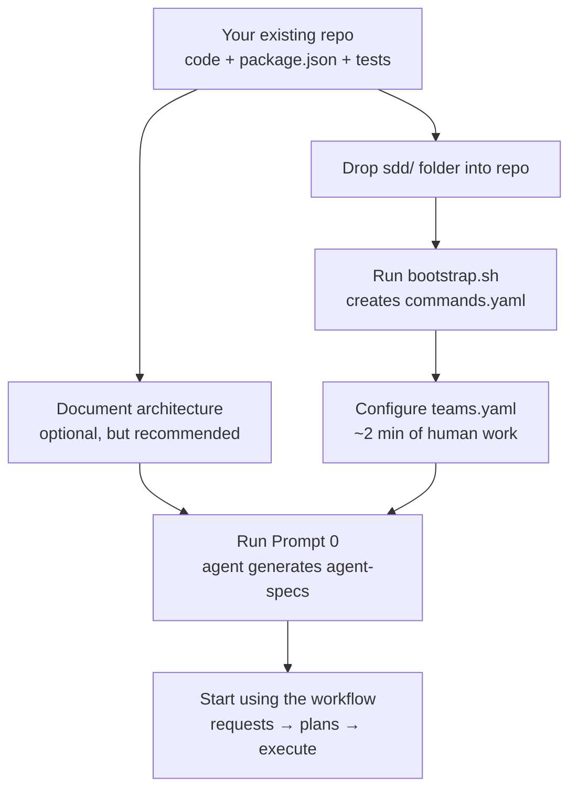

# Adopting SDD in an Existing Project

> **Audience:** Developers dropping the `sdd/` boilerplate into a repo that already has code, tests, and a build pipeline.
>
> **Time:** ~15 minutes for the mechanical steps (Phases 1–2), then one agent conversation for Phase 3.
>
> **Prerequisite:** You have an existing repo with a `package.json` (or equivalent build config) and working tests/lint commands.

---

## The Big Picture



The order matters. `bootstrap.sh` runs **before** the agent generates specs so that Prompt 0 produces files that correctly reference `bin/dev` commands (not raw `pnpm lint`).

---

## Phase 1: Prepare Your Repo

Your repo already exists. It has source code, tests, and a package manager. This phase is about getting the lay of the land.

### Optional: Document your architecture

If you have time, create an `architecture-documentation/` directory (or equivalent) with notes about:
- What the system does (domain, users, key workflows)
- How modules are organized
- Design patterns in use
- Database schema overview

This is read-only reference material. Prompt 0 will use it (alongside the source code) to generate accurate agent-specs. If you skip this, the agent will still read your source code directly — but explicit notes produce better results.

---

## Phase 2: Mechanical Setup (No AI Needed)

### Step 1: Copy `sdd/` into your repo root

```bash
# If adopting from a template repo:
cp -r path-to-sdd-boilerplate/sdd ./sdd

# Or if cloning the boilerplate separately:
git clone <sdd-boilerplate-url> /tmp/sdd-source
cp -r /tmp/sdd-source/sdd ./sdd
rm -rf /tmp/sdd-source
```

You now have the full SDD structure: templates, prompts, bin/dev scripts, and config stubs.

### Step 2: Run `bootstrap.sh`

```bash
bash bin/bootstrap.sh
```

**What it does:**

| Step | Action |
|------|--------|
| Prerequisites check | Verifies Bash 4+, Git, and optionally `gh` CLI |
| Detect project structure | Finds package manager from lock file, reads `package.json` scripts |
| Create `commands.yaml` | Maps `bin/dev` commands to your actual build/test/lint commands |
| Set permissions | Makes `bin/dev` and all command scripts executable |
| Git hooks guidance | Detects lefthook/husky and prints configuration instructions |
| Update `.gitignore` | Adds `sdd/.agent-audit-log` (session-only, not committed) |

**After it runs**, review `config/commands.yaml` — the auto-detection is good but not perfect. Adjust any commands that don't match your setup:

```yaml
# config/commands.yaml (example output)
package_manager: pnpm

commands:
  build: "pnpm run build"
  lint: "pnpm lint-nofix"        # ← verify this matches YOUR lint script
  lint_fix: "pnpm lint"
  typecheck: "pnpm tscheck"      # ← your project might call this "type-check"
  test: "pnpm test"
  test_cov: "pnpm test:cov"
```

### Step 3: Configure `teams.yaml`

Open `config/teams.yaml` and fill in your team's details:

```yaml
teams:
  your-team:
    display_name: "Your Team Name"

    jira:
      project_key: "PROJ"           # ← Your Jira project key
      board_id: null                 # ← Sprint board ID (optional)
      issue_types:
        epic: "Epic"
        task: "Story"                # ← What issue type tasks become
        bug: "Bug"
        subtask: "Sub-task"
      mandatory_fields:
        - summary
        - description
        - priority
      default_values:
        priority: "Minor"
        labels: []

    branching:
      base_branch: "main"            # ← or "develop", "master", etc.
      ticket_id_pattern: "[A-Z][A-Z0-9]+-\\d+"
      branch_format: "<type>/<ticket-id>-<short-description>"
      branch_types: [feat, fix, chore, hotfix, refactor, docs, ci]

    conventions:
      commit_co_author: "Copilot <your-copilot-noreply@email>"
      pr_merge_strategy: "squash"
      pr_draft_by_default: true

active_team: "your-team"
```

This takes about 2 minutes. The values here drive `bin/dev branch`, `bin/dev pr:draft`, and the commit-msg hook.

### Step 4: Install git hooks

Follow the instructions printed by `bootstrap.sh`. For lefthook:

```yaml
# lefthook.yml
pre-commit:
  commands:
    validate-sdd:
      glob: "sdd/**/*.{yaml,yml,md}"
      run: bash bin/hooks/pre-commit

commit-msg:
  commands:
    conventional-commit:
      run: bash bin/hooks/commit-msg {1}
```

### Step 5: Verify the setup

```bash
bin/dev help        # Should print the full command catalog
bin/dev verify      # Should detect changed files and run relevant checks
```

If `bin/dev help` works, Phase 2 is complete.

---

## Phase 3: Agent Configures Itself (One Conversation)

### Run the Bootstrap

1. Open a new agent session in your IDE.
2. Describe your project: what it does, who it's for, tech stack, key architectural decisions.
3. Point the agent at your source code (if any) and say: "Bootstrap the agent-specs for this project"
4. The agent loads the `sdd-bootstrap-specs` skill (or use `user-development/prompts/0-bootstrap-specs.md` as fallback) and produces all five files in `agent-development/agent-specs/`:

| File | What It Contains |
|------|------------------|
| `agent-instructions.md` | Coding standards, referencing `bin/dev` commands |
| `agent-workflow.md` | Execution rules, blast radius, commit protocol |
| `application-overview.md` | What the app does, core workflows |
| `architecture-breakdown.md` | Directory tree, patterns, modules |
| `git-workflow.md` | Branching using your `teams.yaml` conventions |

**Why this order works:** The agent reads `commands.yaml` and `teams.yaml` (created in Phase 2), so the generated specs correctly say "run `bin/dev lint`" instead of "run `pnpm lint-nofix`".

---

## Phase 4: Ready to Work

### First commit

```bash
git add sdd/
git commit -m "chore: adopt SDD boilerplate with project specs"
```

### Start using the workflow

In a fresh agent session, simply state your intent. The agent loads the appropriate skill automatically:

| I want to… | Say something like… | Skill loaded |
|------------|---------------------|-------------|
| Request a new feature | "I want to add email notifications" | `sdd-create-request` |
| Define a large multi-task epic | "Create an epic for the new payments feature" | `sdd-create-epic` |
| Break down an epic | "Break down the epic in `epics/active/1-payments/`" | `sdd-break-down-epic` |
| Refine a task | "Refine `epics/active/1-payments/requests/2-api.md`" | `sdd-refine-request` |
| Plan a task | "Plan the task in `pending/1-docker-infrastructure.md`" | `sdd-plan-task` |
| Execute an approved plan | "Execute the plan in `plans/1-docker-infrastructure/`" | `sdd-execute-plan` |
| Make a quick fix | "Rename the `/books/list` endpoint to `/books`" | `sdd-quick-fix` |

For the full pipeline details, read `user-development/DEVELOPMENT-GUIDE.md`.
For end-to-end team choreography with Figma/Jira/GitHub, read `user-development/SQUAD_FLOW.md`.

---

## How `bin/dev` Works

`bin/dev` is the single entry point for all agent-facing operations. It's not a build tool — it's a **thin dispatch layer** that maps abstract commands to your project's actual scripts.

### Architecture

```
bin/
├── dev                   ← Main dispatcher (reads command, finds script, runs it)
├── bootstrap.sh          ← One-time setup (creates commands.yaml)
├── commands/             ← One script per command
│   ├── _common.sh        ← Shared utilities (logging, YAML parsing, git helpers)
│   ├── build.sh          ← Runs your build command
│   ├── verify.sh         ← Smart: detects changed files, runs only relevant checks
│   ├── branch.sh         ← Creates branches following teams.yaml conventions
│   ├── pr-draft.sh       ← Opens draft PRs via gh CLI
│   ├── note.sh           ← Records agent discoveries for human review
│   └── ...               ← More commands (lint, test, wf-status, etc.)
└── hooks/                ← Git hook scripts (conventional commits, manifest validation)
```

### How the dispatcher works

```bash
bin/dev lint        # → sources commands/lint.sh
bin/dev pr:draft    # → sources commands/pr-draft.sh (: becomes -)
bin/dev wf:status   # → sources commands/wf-status.sh
bin/dev unknown     # → "Unknown command: unknown" + exit 127
```

1. `bin/dev` receives a command name
2. Translates `:` to `-` for file lookup (e.g., `pr:draft` → `pr-draft.sh`)
3. Checks if `commands/<name>.sh` exists — rejects unknown commands
4. Sources `_common.sh` for utilities (logging, config reading, git helpers)
5. Sources and executes the command script
6. Logs the invocation to `.agent-audit-log` (gitignored, session-only)

### The indirection layer (`commands.yaml`)

Build/test commands don't call your tools directly. They read `commands.yaml`:

```bash
# Inside commands/lint.sh:
lint_cmd="$(get_command "lint")"   # reads commands.yaml → "pnpm lint-nofix"
eval "${lint_cmd}"
```

This means:
- **Portability** — Same `bin/dev lint` works across projects with different package managers
- **Discoverability** — `bin/dev help` shows what's available
- **Safety** — Unknown commands are rejected, no accidental `rm -rf`
- **Audit trail** — Every invocation is timestamped in `.agent-audit-log`

### Smart verification (`bin/dev verify`)

The `verify` command is the most sophisticated — it detects what files changed and runs only the relevant checks:

| Files changed | What runs |
|---------------|-----------|
| Only `.md` files | Nothing (docs don't need verification) |
| Test files (`.spec.ts`, `.test.ts`) | Just tests |
| Source code (`.ts`, `.tsx`, `.js`) | Lint + typecheck + tests |
| Prisma schema | Regenerate client + typecheck |
| Config files (`.json`, `.yaml`) | Typecheck only |

If no changes are detected, it falls back to running everything.

### Git flow commands

| Command | What it does |
|---------|--------------|
| `bin/dev branch feat PROJ-123 add-filters` | Creates `feat/PROJ-123-add-filters` from base branch |
| `bin/dev branch:check` | Validates current branch name against conventions |
| `bin/dev pr:draft "My PR title"` | Opens draft PR via `gh`, generates body with ticket link |
| `bin/dev pr:ready` | Runs `verify:full`, then promotes draft to ready-for-review |
| `bin/dev pr:status` | Shows current PR status |

### Agent notes protocol

Agents record things they discover during work:

```bash
bin/dev note "The config module doesn't export its types"
bin/dev note --type=suggestion "Need a command to reset test DB"
bin/dev note --type=friction "Had to read 5 files to find the service"
```

Types: `discovery` (default), `suggestion`, `friction`, `question`

Notes accumulate in `sdd/.agent-notes` (committed to the repo). Humans review them on cadence. This creates a feedback loop: agent friction → human reviews → tooling/docs improve.

### Workflow status

```bash
bin/dev wf:status
```

Scans YAML frontmatter across the SDD directory tree and prints a dashboard:
- Active epics (from `epics/active/`)
- Pending requests (from `agent-development/pending/`)
- Plans and their status/stage progress (from `agent-development/plans/`)

### Workflow intelligence

| Command | What it does |
|---------|------|
| `bin/dev wf:next` | Shows approved plans with all dependencies met — the next thing to work on |
| `bin/dev wf:blockers` | Lists open questions in specs and pending amendments in manifests |
| `bin/dev wf:archive <epic> [--dry-run]` | Moves completed epic + plans to `done/`, updates status, commits. `--dry-run` previews safely. |

### PR review

```bash
bin/dev review 109            # Full review packet
bin/dev review 109 --no-diff  # Metadata + plan context only (skip the diff)
```

Produces a structured review packet:
1. **PR metadata** — title, state, branch, additions/deletions, URL
2. **Related plan** — found by matching branch name or ticket ID against `agent-development/plans/`
3. **Blast radius** — extracted from plan stage files (which files the plan was allowed to touch)
4. **PR description** — the body text
5. **Full diff** — via `gh pr diff` (can be skipped with `--no-diff`)

This is especially useful for human reviewers who want all context assembled in one place without hunting through plan files and GitHub UI separately.

---

## Adding `bin/dev` to an Existing AGENTS.md

If your project already has an `AGENTS.md` or equivalent rules file, add this section:

```markdown
## Agent Entrypoint (`bin/dev`)

**All agent operations MUST go through `bin/dev`** — do not run raw package manager commands.

| Command | Purpose |
|---------|---------|
| `bin/dev build` | Compile/build |
| `bin/dev lint` | Lint (check only) |
| `bin/dev test [files]` | Run tests |
| `bin/dev verify [files]` | Smart: lint + typecheck + test (scoped to changes) |
| `bin/dev verify:full` | Full suite: build + lint + typecheck + test |
| `bin/dev branch <type> <ticket> <desc>` | Create a branch |
| `bin/dev pr:draft [title]` | Open a draft PR |
| `bin/dev pr:ready` | Promote to ready (after verify passes) |
| `bin/dev wf:next` | Show next approved plan ready to execute |
| `bin/dev wf:blockers` | List open questions and pending amendments |
| `bin/dev wf:archive <epic>` | Archive completed epic |
| `bin/dev review <pr-number>` | Structured review packet |
| `bin/dev note "msg"` | Record a discovery |
| `bin/dev wf:status` | Show workflow status |

Run `bin/dev help` for the full catalog.
```

---

## Extending `bin/dev` for Your Project

### Adding a new command

1. Create `bin/commands/your-command.sh`
2. It's instantly available as `bin/dev your:command` (or `bin/dev your-command`)
3. Use utilities from `_common.sh`: `log_info`, `log_success`, `get_command`, `get_current_branch`, etc.

```bash
#!/usr/bin/env bash
# bin/dev db:reset — Reset the development database
set -euo pipefail

log_step "Resetting development database..."
# Your project-specific logic here
eval "$(get_command "prisma_migrate")" -- reset
log_success "Database reset complete"
```

### Adding a project-specific command to `commands.yaml`

```yaml
commands:
  # ... standard commands ...
  db_reset: "pnpm prisma migrate reset --force"
  seed: "pnpm run seed"
  docker_up: "docker compose up -d"
```

---

## Troubleshooting

| Problem | Solution |
|---------|----------|
| `bin/dev: Permission denied` | Run `chmod +x bin/dev` |
| `Unknown command` | Check if `bin/commands/<name>.sh` exists |
| Commands not finding your build scripts | Review `config/commands.yaml` — the detected values may be wrong |
| `bash: bad array subscript` | You need Bash 4+. On macOS: `brew install bash` |
| Hook not running | Verify lefthook/husky is installed and configured |
| `verify` runs everything even for small changes | Make sure you're comparing against the right base branch in `teams.yaml` |

---

## FAQ

**Q: Can I use `bin/dev` without the rest of SDD?**
A: Yes. `bin/dev` is a standalone tool. If you only want the CLI wrapper + audit trail + git hooks without the full request/plan/execute pipeline, just use `bin/` and `config/` — ignore everything else.

**Q: Do I need to symlink `bin/dev` to the repo root?**
A: No. Agents and humans call it as `bin/dev` (from the repo root). If you prefer a shorter path, you can symlink: `ln -s bin/dev bin/dev` — but it's optional.

**Q: What if my project isn't JavaScript/TypeScript?**
A: `bin/dev` is language-agnostic. Set your commands in `commands.yaml` to whatever your project uses (`cargo build`, `go test ./...`, `pytest`, etc.). The shell scripts don't assume any specific language.

**Q: Does `bin/dev` replace my Makefile / Taskfile / Just?**
A: It can, but doesn't have to. `bin/dev` is specifically designed as the **agent-facing** entry point. You can keep your existing task runner for human use and have `commands.yaml` delegate to it (e.g., `build: "make build"`).

**Q: How does this differ from just using `package.json` scripts?**
A: Three things: (1) **command rejection** — agents can't run arbitrary commands, (2) **audit trail** — every invocation is logged, (3) **portability** — same `bin/dev verify` works across all your repos regardless of their underlying tooling.
