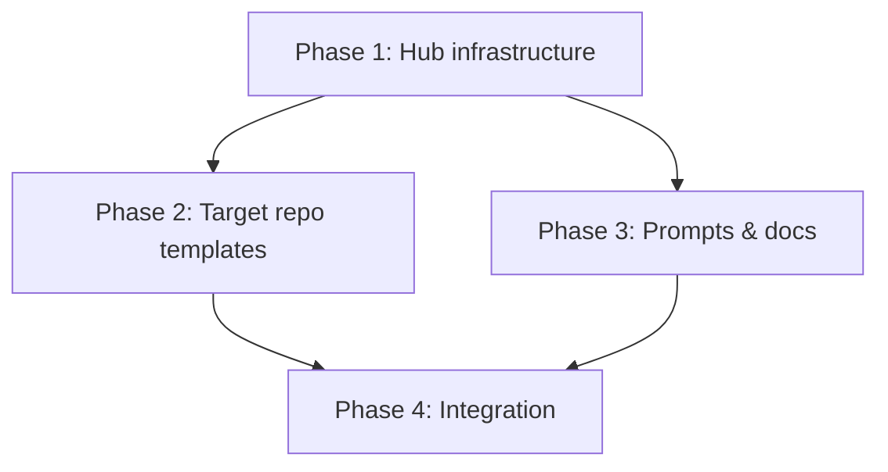

# Design Specification: Git-Native SDD Flow with GitHub Copilot Cloud Agent

> **Purpose:** This is a complete implementation specification for a new branch (`git-flow`) of the SDD Multirepo Hub boilerplate. An agent reading this document should be able to construct the entire feature from scratch.
>
> **Branch:** `git-flow` (branched from current `main`)
>
> **Core idea:** Replace the local filesystem-based SDD workflow state machine with a Git-native, PR-based, CI-driven workflow powered by GitHub Copilot Cloud Agent. PRs become the gates, GitHub Actions become the orchestrator, and Copilot becomes the execution engine.

---

## Table of Contents

- [1. Philosophy & Motivation](#1-philosophy--motivation)
- [2. Architecture Overview](#2-architecture-overview)
- [3. The Complete Flow](#3-the-complete-flow)
- [4. GitHub Actions Specifications](#4-github-actions-specifications)
- [5. Copilot Instruction Files](#5-copilot-instruction-files)
- [6. Prompt Templates (New & Modified)](#6-prompt-templates-new--modified)
- [7. Repository File Changes](#7-repository-file-changes)
- [8. Cross-Repo Context Strategy](#8-cross-repo-context-strategy)
- [9. Alignment Check Design](#9-alignment-check-design)
- [10. Jira Integration](#10-jira-integration)
- [11. Epic Lifecycle in Git](#11-epic-lifecycle-in-git)
- [12. Conventions & Configuration](#12-conventions--configuration)
- [13. Migration from Current Flow](#13-migration-from-current-flow)
- [14. Implementation Plan](#14-implementation-plan)

---

## 1. Philosophy & Motivation

### Why Move to Git-Native?

The current SDD workflow tracks state by moving files between local directories (`pending/` → `plans/` → `done/`). This works for a single developer with IDE-based agents but breaks down when:

- Multiple engineers need visibility into what's planned/in-progress/done
- Cloud-based agents (not IDE copilots) need to execute work asynchronously
- Approval gates need to be enforceable (not just "trust the human moved the file")
- Audit trails need to be automatic and tamper-resistant

### The Core Shift

| Aspect | Current (Local) | New (Git-Native) |
|--------|----------------|-------------------|
| State machine | File location (`pending/`, `plans/`, `done/`) | PR status (draft → approved → merged) |
| Approval gate | Human edits `approval.status` in YAML | Human merges PR (enforced by branch protection) |
| Agent execution | IDE-based (Copilot in VS Code/Zed) | Cloud-based (GitHub Copilot Cloud Agent) |
| Visibility | Local filesystem, `bin/dev status` | GitHub PR list, Issues, Actions dashboard |
| Triggering | Human pastes prompt into conversation | GitHub Actions triggers agent via API |
| Audit trail | Git commits + `.agent-audit-log` | PR history + Actions logs + commit history |

### Principles Preserved

These principles from the original SDD remain unchanged:

1. **Humans define WHAT, agents figure out HOW**
2. **No code without an approved plan**
3. **Source code is the source of truth**
4. **One epic per developer at a time** (but multiple epics active concurrently)
5. **Cross-repo dependencies are explicit**

### New Principles

6. **PRs are the universal interface** — if it's not in a PR, it doesn't exist
7. **GitHub Actions is the orchestrator** — all automated transitions are GH Actions
8. **Copilot Cloud Agent is the execution engine** — all agent work goes through it
9. **Issues are the dispatch mechanism** — assigning an issue to `@copilot` starts work
10. **The hub bundles context at dispatch time** — target repos don't need hub access at runtime

---

## 2. Architecture Overview

### System Topology

```
┌─────────────────────────────────────────────────────────────────────┐
│  HUB REPO (github.com/org/domain-hub)                               │
│  ────────────────────────────────────────                            │
│  Owns: Epic planning, task graphs, delivery manifests, specs         │
│  Actions: epic-dispatch.yml, sync-status.yml                         │
│  Does NOT contain: application code                                  │
│                                                                       │
│  epics/active/N-name/                                                 │
│    ├── epic.md            (product brief)                            │
│    ├── task-graph.md      (DAG with repo assignments)                │
│    ├── delivery.yaml      (PR tracking across repos)                 │
│    └── requests/          (task request documents)                    │
│                                                                       │
│  fallback-sdd/<repo>/     (specs for repos without own docs)         │
│  documentation/<repo>/    (architecture docs)                         │
│  contracts/<repo>/        (API schemas)                               │
└──────────────────────────┬──────────────────────────────────────────┘
                           │
          GitHub Actions: epic-dispatch.yml
          (parses epic, creates issues in target repos with bundled context)
                           │
         ┌─────────────────┼─────────────────┐
         ▼                 ▼                 ▼
┌─────────────────┐ ┌─────────────────┐ ┌─────────────────┐
│  Target Repo A  │ │  Target Repo B  │ │  Target Repo C  │
│  ─────────────  │ │  ─────────────  │ │  ─────────────  │
│  .github/       │ │  .github/       │ │  .github/       │
│   workflows/    │ │   workflows/    │ │   workflows/    │
│    plan-merged  │ │    plan-merged  │ │    plan-merged  │
│    align-check  │ │    align-check  │ │    align-check  │
│    sync-hub     │ │    sync-hub     │ │    sync-hub     │
│   copilot-      │ │   copilot-      │ │   copilot-      │
│    instructions │ │    instructions │ │    instructions │
│   instructions/ │ │   instructions/ │ │   instructions/ │
│  AGENTS.md      │ │  AGENTS.md      │ │  AGENTS.md      │
│  sdd/plans/     │ │  sdd/plans/     │ │  sdd/plans/     │
│  (source code)  │ │  (source code)  │ │  (source code)  │
└─────────────────┘ └─────────────────┘ └─────────────────┘
```

### Two Types of GitHub Actions

| Type | Where | Purpose | Examples |
|------|-------|---------|----------|
| **Hub Actions** | Hub repo only | Coordination, dispatch, status aggregation | `epic-dispatch.yml`, `sync-status.yml` |
| **Repo Actions** | Each target repo | Execution pipeline, checks, sync-back | `plan-merged.yml`, `alignment-check.yml`, `sync-hub.yml`, `copilot-setup-steps.yml` |

---

## 3. The Complete Flow

### Phase 0: Epic Creation (Human + Agent, in Hub)

**Trigger:** Human wants to plan a cross-repo feature.

**Process:**
1. Human opens the Agents panel on `github.com/org/domain-hub`
2. Prompts: "Create an epic for [feature description]" (using epic creation instructions)
3. Agent creates a branch `epic/N-short-name` and opens a **PR** containing:
   - `epics/active/N-name/epic.md`
   - `epics/active/N-name/task-graph.md`
   - `epics/active/N-name/delivery.yaml`
   - `epics/active/N-name/requests/*.md` (request shells)
4. Human reviews the epic PR, refines via PR comments (`@copilot refine task 3...`)
5. Human creates Jira tickets (via MCP or manually) and records IDs in task-graph
6. Human **merges** the epic PR → epic is now on `main` and visible to all

### Phase 1: Task Dispatch (Automated, Hub → Target Repos)

**Trigger:** Epic PR merged to hub's `main`.

**Process:**
1. `epic-dispatch.yml` fires on `pull_request: closed` (merged) with path filter `epics/active/**`
2. The action reads `task-graph.md` and for each task with `status: refined`:
   - Identifies the target repo from the task's `repo` field
   - Reads the task's request file from `requests/`
   - Reads relevant specs from `fallback-sdd/<repo>/agent-specs/` or `documentation/<repo>/`
   - Creates a GitHub Issue in the target repo with:
     - Title: `plan: <JIRA-ID> <task title>`
     - Body: full context (request, epic summary, architecture specs, plan instructions)
     - Assignee: `copilot`
     - Labels: `sdd-plan`, `epic-N`
3. Updates `task-graph.md` on hub's main: task status → `activated`

### Phase 2: Plan PR (Copilot Cloud Agent, in Target Repo)

**Trigger:** Issue assigned to `@copilot` with label `sdd-plan`.

**Process:**
1. Copilot Cloud Agent picks up the issue
2. Reads issue body (contains full context bundled by hub)
3. Reads `.github/copilot-instructions.md` and `AGENTS.md` for methodology rules
4. Creates branch: `plan/<JIRA-ID>-<short-description>`
5. Writes plan files to `sdd/plans/<N-task-name>/`:
   - `manifest.yaml` (machine-readable plan metadata)
   - `specification.md` (human-readable overview, open questions)
   - Stage instruction files (`1-stage-name.md`, `2-stage-name.md`, ...)
6. Opens a **PR** targeting `main`:
   - Title: `plan: <JIRA-ID> <task title>`
   - Body: links to issue, summary of approach, open questions highlighted
   - Labels: `sdd-plan`
   - Reviewers: auto-assigned from CODEOWNERS or team config
7. Copilot requests review

**Human reviews:**
- Reads the plan (docs only — easy to review)
- Resolves `PENDING` open questions via PR comments
- Copilot iterates based on feedback
- Human **merges** when satisfied → plan is on `main`

### Phase 3: Code PR (Copilot Cloud Agent, in Target Repo)

**Trigger:** Plan PR merged (detected by `plan-merged.yml`).

**Process:**
1. `plan-merged.yml` fires on `pull_request: closed` (merged) with path filter `sdd/plans/**`
2. The action creates a new issue in the same repo:
   - Title: `implement: <JIRA-ID> <task title>`
   - Body: "Execute the approved plan. Plan files on main at `sdd/plans/<N>/`. Read `specification.md` for the full approach and stage instructions."
   - Assignee: `copilot`
   - Labels: `sdd-execute`, `epic-N`
3. Copilot Cloud Agent picks up the issue
4. Reads the plan from `main` (where it was just merged)
5. Creates branch: `feat/<JIRA-ID>-<short-description>`
6. Executes stages sequentially:
   - Reads each stage instruction file
   - Implements changes, runs verification (lint, test, typecheck)
   - Commits with conventional commit messages
   - Pushes incrementally (draft PR auto-updates)
7. Opens **Code PR** targeting `main`:
   - Title: `feat(<scope>): <JIRA-ID> <description>`
   - Body: references plan PR, implementation notes, verification results
   - Labels: `sdd-execute`, `epic-N`
8. When all stages complete, marks PR as **ready for review**

### Phase 4: Alignment Check & Code Review

**Trigger:** Code PR marked ready for review (or on each push, configurable).

**Process:**
1. `alignment-check.yml` fires
2. Reads the original epic from the hub (via cross-repo dispatch or cached in issue)
3. Reads the plan files from main
4. Compares the code diff against the plan and epic intent
5. Posts a **PR review comment** with findings:
   ```
   ## 🔍 Alignment Check (confidence: XX%)
   
   **Status:** ✅ On track / ⚠️ Potential drift detected
   
   **Findings:**
   - [finding details]
   
   **Options — reply to this comment:**
   - `@copilot add this to the current PR`
   - `@copilot create a follow-up issue for this`
   - `acknowledged` — dismiss, intentional
   ```
6. Human reviews code, leaves feedback
7. Copilot iterates on PR comments
8. Human **merges** → code is on `main`, deploys per repo's CI/CD

### Phase 5: Sync Back to Hub

**Trigger:** Code PR merged (detected by `sync-hub.yml`).

**Process:**
1. `sync-hub.yml` fires on `pull_request: closed` (merged) with label `sdd-execute`
2. The action updates the hub repo (via cross-repo API call):
   - `delivery.yaml`: node status → `merged`, adds `pr_url`, `pr_number`
   - `task-graph.md`: task status → `done`
3. Transitions Jira ticket to "Done" (via MCP or API)
4. If all tasks in epic are `done`: posts a comment on the epic's original PR thread notifying the team

---

## 4. GitHub Actions Specifications

### 4.1 Hub Actions

#### `epic-dispatch.yml` (Hub Repo)

**Location:** `hub/.github/workflows/epic-dispatch.yml`

**Triggers:** `pull_request: closed` (merged), paths: `epics/active/**`

**What it does:**
1. Reads the merged epic's `task-graph.md`
2. For each task with status `refined` (or a configurable list):
   - Resolves target repo from `config/repos.yaml`
   - Assembles context bundle (request + epic summary + relevant specs)
   - Creates a GitHub Issue in the target repo via API
   - Assigns to `copilot`
   - Applies labels: `sdd-plan`, `epic-<N>`
3. Commits updated `task-graph.md` (statuses → `activated`) back to hub main

**Inputs/Config:**
- `ORG_TOKEN` secret with `repo` scope (to create issues in other repos)
- Reads `config/repos.yaml` for repo metadata
- Reads `fallback-sdd/<repo>/agent-specs/` for context bundling

**Error handling:**
- If issue creation fails for a task, logs error and continues with remaining tasks
- Posts a summary comment on the merged epic PR with dispatch results

#### `sync-status.yml` (Hub Repo)

**Location:** `hub/.github/workflows/sync-status.yml`

**Triggers:** `workflow_dispatch` (manual) OR `schedule` (daily)

**What it does:**
1. For each active epic, queries target repos for PR statuses
2. Updates `delivery.yaml` nodes with current PR states
3. Commits changes if any updates were found

**Purpose:** Catches any sync-back failures and keeps hub state accurate.

---

### 4.2 Target Repo Actions

#### `copilot-setup-steps.yml` (Target Repo)

**Location:** `<repo>/.github/workflows/copilot-setup-steps.yml`

**Purpose:** Pre-configures Copilot Cloud Agent's ephemeral environment.

```yaml
name: "Copilot Setup Steps"

on:
  workflow_dispatch:
  push:
    paths:
      - .github/workflows/copilot-setup-steps.yml
  pull_request:
    paths:
      - .github/workflows/copilot-setup-steps.yml

jobs:
  copilot-setup-steps:
    runs-on: ubuntu-latest
    permissions:
      contents: read
    steps:
      - name: Checkout code
        uses: actions/checkout@v6

      - name: Setup Node.js
        uses: actions/setup-node@v4
        with:
          node-version: "20"
          cache: "pnpm"

      - name: Install dependencies
        run: pnpm install --frozen-lockfile
```

**Note:** This is repo-specific. Each target repo customizes based on its tech stack.

#### `plan-merged.yml` (Target Repo)

**Location:** `<repo>/.github/workflows/plan-merged.yml`

**Triggers:** `pull_request: closed` (merged), paths: `sdd/plans/**`

**What it does:**
1. Extracts task metadata from the merged plan's `manifest.yaml`
2. Creates a new issue in the same repo:
   - Title: `implement: <JIRA-ID> <task title>`
   - Body: execution instructions + plan location on main
   - Assignee: `copilot`
   - Labels: `sdd-execute`, extracts `epic-N` label from source PR
3. Transitions Jira ticket to "In Development" (optional, via MCP/API)

```yaml
name: "Plan Merged — Trigger Execution"

on:
  pull_request:
    types: [closed]
    paths:
      - 'sdd/plans/**'

jobs:
  trigger-execution:
    if: github.event.pull_request.merged == true
    runs-on: ubuntu-latest
    permissions:
      contents: read
      issues: write
    steps:
      - name: Checkout
        uses: actions/checkout@v6

      - name: Extract plan metadata
        id: meta
        run: |
          # Find the manifest.yaml in the merged plan
          PLAN_DIR=$(find sdd/plans -name "manifest.yaml" -path "*$(echo '${{ github.event.pull_request.title }}' | grep -oP 'JIRA-\d+')*" | head -1 | xargs dirname)
          echo "plan_dir=$PLAN_DIR" >> $GITHUB_OUTPUT
          # Extract JIRA ID and title from manifest
          JIRA_ID=$(yq '.plan_metadata.jira_ticket' "$PLAN_DIR/manifest.yaml")
          TITLE=$(yq '.plan_metadata.title' "$PLAN_DIR/manifest.yaml")
          echo "jira_id=$JIRA_ID" >> $GITHUB_OUTPUT
          echo "title=$TITLE" >> $GITHUB_OUTPUT

      - name: Create execution issue
        uses: actions/github-script@v7
        with:
          script: |
            const planDir = '${{ steps.meta.outputs.plan_dir }}';
            const jiraId = '${{ steps.meta.outputs.jira_id }}';
            const title = '${{ steps.meta.outputs.title }}';
            
            // Copy labels from source PR (to preserve epic-N label)
            const labels = context.payload.pull_request.labels
              .map(l => l.name)
              .filter(n => n.startsWith('epic-'));
            labels.push('sdd-execute');
            
            await github.rest.issues.create({
              owner: context.repo.owner,
              repo: context.repo.repo,
              title: `implement: ${jiraId} ${title}`,
              body: [
                `## Execute Approved Plan`,
                ``,
                `**Plan location:** \`${planDir}/\``,
                `**Plan PR:** #${context.payload.pull_request.number}`,
                `**Jira:** ${jiraId}`,
                ``,
                `### Instructions`,
                ``,
                `1. Read the plan at \`${planDir}/specification.md\``,
                `2. Read all stage files in order`,
                `3. Create branch \`feat/${jiraId.toLowerCase()}-...\``,
                `4. Execute each stage, committing incrementally`,
                `5. Run verification after each stage (lint, typecheck, test)`,
                `6. Open a PR when all stages pass`,
                ``,
                `### Commit Convention`,
                ``,
                `Use conventional commits: \`feat(<scope>): ${jiraId} <description>\``,
                `Include co-author trailer as specified in AGENTS.md.`,
              ].join('\n'),
              assignees: ['copilot'],
              labels: labels,
            });
```

#### `alignment-check.yml` (Target Repo)

**Location:** `<repo>/.github/workflows/alignment-check.yml`

**Triggers:** `pull_request: ready_for_review` OR `pull_request_review: submitted` (when approved)

**What it does:**
1. Reads the code diff from the PR
2. Reads the plan files referenced in the PR body (from main)
3. Reads the original epic context (from the issue that spawned this work)
4. Calls an LLM API (GitHub Models or configured endpoint) to compare intent vs. implementation
5. Posts a PR review comment with findings and confidence score

```yaml
name: "Alignment Check"

on:
  pull_request:
    types: [ready_for_review]

jobs:
  alignment-check:
    if: contains(github.event.pull_request.labels.*.name, 'sdd-execute')
    runs-on: ubuntu-latest
    permissions:
      contents: read
      pull-requests: write
      issues: read
    steps:
      - name: Checkout
        uses: actions/checkout@v6
        with:
          fetch-depth: 0

      - name: Get PR diff
        id: diff
        run: |
          git diff origin/main...HEAD -- ':!sdd/' > /tmp/code_diff.txt
          echo "diff_file=/tmp/code_diff.txt" >> $GITHUB_OUTPUT

      - name: Get plan context
        id: plan
        run: |
          # Extract plan dir from PR body
          PLAN_DIR=$(echo "${{ github.event.pull_request.body }}" | grep -oP 'sdd/plans/[^\s`]+')
          cat "$PLAN_DIR/specification.md" > /tmp/plan_context.txt
          echo "plan_file=/tmp/plan_context.txt" >> $GITHUB_OUTPUT

      - name: Run alignment check
        id: check
        uses: actions/github-script@v7
        with:
          script: |
            // Call LLM API with diff + plan + epic context
            // Return: { confidence: number, status: string, findings: string[] }
            // Implementation depends on which LLM API is configured
            // See section 9 for the prompt template used here

      - name: Post review comment
        uses: actions/github-script@v7
        with:
          script: |
            const result = JSON.parse('${{ steps.check.outputs.result }}');
            const emoji = result.confidence >= 85 ? '✅' : '⚠️';
            const status = result.confidence >= 85 ? 'On track' : 'Potential drift detected';
            
            const body = [
              `## 🔍 Alignment Check (confidence: ${result.confidence}%)`,
              ``,
              `**Status:** ${emoji} ${status}`,
              ``,
              `**Findings:**`,
              ...result.findings.map(f => `- ${f}`),
              ``,
              `---`,
              `**Options — reply to this comment:**`,
              `- \`@copilot add this to the current PR\` — expand scope`,
              `- \`@copilot create a follow-up issue for this\` — new task`,
              `- \`acknowledged\` — dismiss, this is intentional`,
            ].join('\n');
            
            await github.rest.pulls.createReview({
              owner: context.repo.owner,
              repo: context.repo.repo,
              pull_number: context.payload.pull_request.number,
              event: 'COMMENT',
              body: body,
            });
```

#### `sync-hub.yml` (Target Repo)

**Location:** `<repo>/.github/workflows/sync-hub.yml`

**Triggers:** `pull_request: closed` (merged) with label `sdd-execute`

**What it does:**
1. Reads PR metadata (number, URL, branch, merge time)
2. Calls the hub repo's API to update `delivery.yaml`:
   - Sets the matching node's status to `merged`
   - Fills `pr_url` and `pr_number`
3. Updates `task-graph.md` task status to `done`
4. Transitions Jira ticket (optional)

**Note:** This action needs a token with write access to the hub repo (`ORG_TOKEN` or a GitHub App).

```yaml
name: "Sync to Hub"

on:
  pull_request:
    types: [closed]

jobs:
  sync-hub:
    if: >
      github.event.pull_request.merged == true &&
      contains(github.event.pull_request.labels.*.name, 'sdd-execute')
    runs-on: ubuntu-latest
    permissions:
      contents: read
    steps:
      - name: Update hub delivery manifest
        uses: actions/github-script@v7
        env:
          HUB_REPO: ${{ vars.HUB_REPO }}  # e.g., "org/domain-hub"
          HUB_TOKEN: ${{ secrets.HUB_TOKEN }}
        with:
          github-token: ${{ secrets.HUB_TOKEN }}
          script: |
            // 1. Read delivery.yaml from hub main
            // 2. Find the node matching this repo + PR
            // 3. Update status to 'merged', set pr_url and pr_number
            // 4. Commit the update to hub main (or open a PR)
            // 5. Update task-graph.md similarly
```

---

## 5. Copilot Instruction Files

### 5.1 Repository-Wide Instructions (`.github/copilot-instructions.md`)

**Location:** Each target repo at `.github/copilot-instructions.md`

**Purpose:** Gives Copilot Cloud Agent repo-specific context so it doesn't waste time exploring.

**Template:**

```markdown
# Copilot Instructions for <Repo Name>

## Repository Overview
<What this service does, key domain concepts>

## Tech Stack
- Language: TypeScript
- Framework: NestJS 10
- Database: PostgreSQL + Prisma 5
- Package manager: pnpm

## Build & Verify Commands
- Install: `pnpm install`
- Build: `pnpm build`
- Test: `pnpm test`
- Lint: `pnpm lint`
- Typecheck: `pnpm tsc --noEmit`
- Full verify: `pnpm lint && pnpm tsc --noEmit && pnpm test`

## Architecture
<Key modules, directory structure, patterns used>

## SDD Workflow Rules

This repo follows Spec-Driven Development. Key rules:
- Plans live in `sdd/plans/<task-name>/`
- When creating a Plan PR: only write documentation/plan files, NO code
- When creating a Code PR: read the approved plan from main, implement exactly what it specifies
- Commit convention: `<type>(<scope>): <JIRA-ID> <description>`
- Always run verification before marking ready for review
- Do not modify files outside the plan's declared blast radius

## Coding Standards
<Key rules: no `any`, use path aliases, testing patterns, etc.>
```

### 5.2 Path-Specific Instructions (`.github/instructions/`)

**Location:** Each target repo at `.github/instructions/`

**Files:**

#### `sdd-planning.instructions.md`
```markdown
---
applyTo: "sdd/plans/**"
---

# SDD Plan File Instructions

When working with plan files:
- Plans contain ONLY documentation (markdown, yaml). Never add source code.
- `manifest.yaml` must follow the schema: plan_metadata.status, stages[], etc.
- `specification.md` must use PENDING markers for unresolved questions
- Stage files must include: blast radius, verification commands, commit plan table
- Set plan_metadata.status to "pending-approval" when complete
```

#### `sdd-execution.instructions.md`
```markdown
---
applyTo: "src/**,lib/**,test/**"
---

# SDD Execution Instructions

When implementing code from an approved plan:
- Read the plan at `sdd/plans/<task>/specification.md` FIRST
- Follow stage instructions in order (1-stage.md, 2-stage.md, ...)
- Only modify files listed in the stage's blast_radius.write
- Commit after each logical unit with conventional commit format
- Run verification after each stage: lint, typecheck, test
- If tests fail: fix (max 2 attempts) or stop and request help via PR comment
- Never skip verification steps
```

### 5.3 Agent Instructions (`AGENTS.md`)

**Location:** Each target repo at root `AGENTS.md`

**This file already exists in the boilerplate pattern.** For the git-flow branch, it needs these additions:

```markdown
## Git-Native SDD Mode

This repo uses the Git-Native SDD workflow. Key differences from local SDD:

### Plan Phase
- You receive work via GitHub Issues (assigned to you with label `sdd-plan`)
- Create a branch `plan/<JIRA-ID>-<description>` and open a PR with plan files only
- The issue body contains all context you need (epic, request, specs)
- Do NOT write code during the plan phase

### Execution Phase
- You receive work via GitHub Issues (assigned to you with label `sdd-execute`)
- The plan is already approved and on `main` — read it from there
- Create a branch `feat/<JIRA-ID>-<description>` and implement the plan
- Push commits incrementally, the draft PR updates automatically
- Mark ready for review only after all stages pass verification

### Commit Convention
<type>(<scope>): <JIRA-ID> <description>

Co-authored-by: Copilot <noreply@github.com>

### Branch Naming
- Plan branches: `plan/<JIRA-ID>-<short-description>`
- Code branches: `feat/<JIRA-ID>-<short-description>`
- Hotfix branches: `fix/<JIRA-ID>-<short-description>`
```

---

## 6. Prompt Templates (New & Modified)

### New Prompts

#### Prompt 9: `9-create-epic-github.md` (Replaces Prompt 5 for GitHub context)

**Purpose:** Used in the GitHub Agents panel to create an epic PR in the hub repo.

**Key difference from Prompt 5:** Instead of interactive local conversation, this is designed for the GitHub Copilot Cloud Agent working asynchronously. It produces the epic PR directly.

```markdown
# Create an Epic (GitHub Cloud Agent)

## Your Role
You are a senior technical product analyst working in the hub repo. 
Your task is to create an epic definition from the provided brief.

## Context
- Read `config/repos.yaml` to understand available repos
- Read `config/teams.yaml` for conventions
- Read existing epics in `epics/active/` and `epics/done/` for numbering

## Instructions
1. Determine the next epic number
2. Create branch `epic/N-short-name`
3. Create `epics/active/N-name/epic.md` following `epics/_templates/epic.md`
4. Create `epics/active/N-name/task-graph.md` following `epics/_templates/task-graph.md`
5. Create `epics/active/N-name/delivery.yaml` following `epics/_templates/delivery.yaml`
6. Create request shell files in `epics/active/N-name/requests/`
7. Open a PR with title `epic(N-name): <epic title>`

## Output Rules
- Epic doc is product-level: WHAT and WHY, not HOW
- Each task must have a `repo` field matching a key in `repos.yaml`
- Mark all tasks as `status: refined` if enough detail, `draft` if shells only
- Use PENDING markers for anything that needs human input
```

#### Prompt 10: `10-alignment-check-prompt.md` (Used by GH Action)

**Purpose:** The system prompt used by the `alignment-check.yml` action when calling the LLM.

```markdown
# Alignment Check System Prompt

You are reviewing a code implementation against its approved plan and parent epic.

## Inputs Provided
- CODE_DIFF: The git diff of the implementation PR
- PLAN: The specification.md from the approved plan
- EPIC_CONTEXT: Summary of the parent epic's goals

## Your Task
Evaluate whether the implementation aligns with the plan and epic intent.

## Evaluate
1. Are all planned changes present in the diff?
2. Are there changes NOT described in the plan? (scope creep)
3. Are there edge cases mentioned in the plan that aren't handled?
4. Does the implementation contradict the epic's stated goals?
5. Are there obvious quality issues? (missing error handling, untested paths, flaky patterns)

## Output Format (JSON)
{
  "confidence": <0-100>,
  "status": "on_track" | "minor_drift" | "significant_drift",
  "findings": [
    "Finding 1: description",
    "Finding 2: description"
  ],
  "missing_from_plan": ["item1", "item2"],
  "additions_beyond_plan": ["item1", "item2"]
}

## Rules
- confidence >= 85 = on_track (no action needed)
- confidence 60-84 = minor_drift (flag for review but don't block)
- confidence < 60 = significant_drift (strongly recommend review)
- Be specific in findings — reference file names and line numbers from the diff
- Do NOT flag stylistic differences as drift
- Do NOT flag additional tests beyond what's planned (more tests = good)
```

### Modified Prompts

The following existing prompts need updates for the git-flow branch:

#### Prompt 1: `1-plan-task.md` → Modified for GitHub Issue Context

**Changes:**
- Remove "read from `agent-development/pending/`" — context comes from the GitHub Issue body
- Add: "Read the issue that triggered this session for full context"
- Add: "Open a PR with plan files when complete (do not wait for user confirmation)"
- Change output location from `agent-development/plans/` to `sdd/plans/`

#### Prompt 2: `2-execute-plan.md` → Modified for GitHub Issue Context

**Changes:**
- Remove pre-flight check for local `approval.status` — plan is approved because it's on main
- Add: "Read the plan from `sdd/plans/<task>/` on the current main branch"
- Remove manual branch creation instructions — agent does this natively
- Remove "wait for my approval of commit plan" — agent works autonomously
- Add: "Mark PR ready for review when all stages pass"
- Remove local archival steps (`done/plans/`, `done/requests/`)

#### Prompt 6: `6-break-down-epic.md` → Modified for PR Output

**Changes:**
- Add: "Create a branch and open a PR with all output files"
- Add: task-graph format must include fields that `epic-dispatch.yml` can parse
- Ensure `delivery.yaml` has enough metadata for automated sync

---

## 7. Repository File Changes

### Files to ADD to the boilerplate (git-flow branch)

| File | Location | Purpose |
|------|----------|---------|
| `GIT-FLOW-DESIGN.md` | Hub root | This document (reference) |
| `.github/workflows/epic-dispatch.yml` | Hub repo | Dispatches tasks to target repos |
| `.github/workflows/sync-status.yml` | Hub repo | Periodic hub status sync |
| `target-repo-template/.github/workflows/copilot-setup-steps.yml` | Template | Copilot env setup |
| `target-repo-template/.github/workflows/plan-merged.yml` | Template | Triggers execution after plan merge |
| `target-repo-template/.github/workflows/alignment-check.yml` | Template | Code alignment validation |
| `target-repo-template/.github/workflows/sync-hub.yml` | Template | Syncs status back to hub |
| `target-repo-template/.github/copilot-instructions.md` | Template | Repo-wide Copilot instructions |
| `target-repo-template/.github/instructions/sdd-planning.instructions.md` | Template | Plan-file-specific instructions |
| `target-repo-template/.github/instructions/sdd-execution.instructions.md` | Template | Code-execution-specific instructions |
| `target-repo-template/AGENTS.md` | Template | Agent rules (git-flow additions) |
| `user-development/prompts/9-create-epic-github.md` | Hub | Cloud agent epic creation |
| `user-development/prompts/10-alignment-check-prompt.md` | Hub | LLM prompt for alignment check |

### Files to MODIFY

| File | Changes |
|------|---------|
| `user-development/DEVELOPMENT-GUIDE.md` | Add new section documenting git-flow as an alternative mode |
| `user-development/prompts/1-plan-task.md` | Adapt for GitHub Issue context |
| `user-development/prompts/2-execute-plan.md` | Adapt for autonomous execution |
| `user-development/prompts/6-break-down-epic.md` | Adapt for PR output |
| `AGENTS.md` | Add git-native SDD mode section |
| `README.md` | Document git-flow branch and when to use it |
| `config/repos.yaml` | Add `hub_repo` field for sync-back configuration |

### Files to REMOVE

| File | Reason |
|------|--------|
| `brainstormed_ideas.md` | Superseded by this design document |

### New Directory Structure Addition

```
target-repo-template/           ← NEW: template files to copy into target repos
├── .github/
│   ├── workflows/
│   │   ├── copilot-setup-steps.yml
│   │   ├── plan-merged.yml
│   │   ├── alignment-check.yml
│   │   └── sync-hub.yml
│   ├── copilot-instructions.md
│   └── instructions/
│       ├── sdd-planning.instructions.md
│       └── sdd-execution.instructions.md
├── AGENTS.md
└── sdd/
    └── plans/
        └── .gitkeep
```

---

## 8. Cross-Repo Context Strategy

### The Problem

Copilot Cloud Agent can only work in one repository per session. When executing in a target repo, it needs context from the hub (epic docs, architecture specs, request details).

### The Solution: Context Bundling at Dispatch Time

The hub's `epic-dispatch.yml` action **embeds all relevant context directly into the GitHub Issue body** when creating issues in target repos. The agent reads the issue → has everything it needs.

**What gets bundled:**

| Context Type | Source in Hub | How It's Bundled |
|---|---|---|
| Task request | `epics/active/N/requests/X-name.md` | Full content in issue body |
| Epic summary | `epics/active/N/epic.md` (summary section only) | Condensed in issue body |
| Architecture specs | `fallback-sdd/<repo>/agent-specs/` | Key sections in issue body |
| Team conventions | `config/teams.yaml` | Relevant fields in issue body |
| Cross-repo context | `contracts/<repo>/`, `architectural-schemas/` | If referenced in request |

**Size management:** GitHub Issues have a 65,535 character body limit. For large specs, the dispatch action includes only the sections relevant to the specific task (referenced by the request's "Implementation Details" section).

### Fallback: Cross-Repo Code Search

If the agent needs additional context mid-execution (rare, if dispatch bundled well):
- Copilot Cloud Agent has access to GitHub code search
- Code search indexes all repos the user has access to in the org
- The agent can search the hub repo for specific doc files
- This is a fallback, not the primary mechanism

---

## 9. Alignment Check Design

### When It Runs

- **Trigger:** `pull_request: ready_for_review` (Code PR only, filtered by `sdd-execute` label)
- **NOT on every push** — only when the agent signals it's done

### What It Checks

1. **Completeness:** Are all planned stages reflected in the code diff?
2. **Scope creep:** Are there changes not described in the plan?
3. **Epic alignment:** Does the implementation serve the epic's stated goals?
4. **Quality signals:** Missing error handling, untested edge cases, incomplete migrations

### How It Posts Results

As a **PR review comment** (not a blocking check). This is deliberate — the alignment check is advisory, not a gate. Reasons:
- False positives would block legitimate work
- The human reviewer is the final authority
- The engineer can acknowledge, expand scope, or create follow-ups

### Cost Management

- Uses a fast model (GPT-4o-mini or Claude Haiku equivalent via GitHub Models)
- Runs ONCE per PR (on `ready_for_review`), not on every push
- Input is bounded: diff + plan spec (not entire codebase)
- Estimated cost: ~$0.01-0.05 per check

### Follow-Up Task Creation

The alignment check does NOT auto-create follow-up tasks. It surfaces findings. The engineer responds via PR comment:

| Engineer Response | What Happens |
|---|---|
| `@copilot add this to the current PR` | Copilot expands scope, pushes more commits |
| `@copilot create a follow-up issue for this` | Copilot creates a new issue in the repo with the finding |
| `acknowledged` | Nothing — finding dismissed |
| (no response) | Finding remains visible for code reviewer |

---

## 10. Jira Integration

### Direction: GitHub → Jira (one-way push)

GitHub PRs are the source of truth. Jira reflects status for PM/stakeholder visibility.

### Transition Points

| GitHub Event | Jira Action | Mechanism |
|---|---|---|
| Epic PR merged (hub) | Create Jira Epic + child tickets | `epic-dispatch.yml` via Jira MCP |
| Plan issue created (target) | Ticket → "Planning" | `epic-dispatch.yml` or manual |
| Plan PR merged (target) | Ticket → "In Development" | `plan-merged.yml` via API |
| Code PR merged (target) | Ticket → "Done" | `sync-hub.yml` via API |

### Ticket Creation

At epic dispatch time, the hub action can create Jira tickets if they don't already exist:
- Reads `config/teams.yaml` for project key, issue type, required fields
- Creates tickets with: summary, description (from request), epic link, dependency links
- Records ticket IDs back into `task-graph.md`

If tickets were created manually beforehand (IDs already in task-graph), the action skips creation and only updates status.

### MCP Usage

Since the organization has Jira + Confluence MCP installed:
- Copilot Cloud Agent can read/write Jira during execution if needed
- The hub agent can create tickets during epic planning
- GH Actions can trigger ticket transitions via Jira REST API directly (no MCP needed for automation)

---

## 11. Epic Lifecycle in Git

### Epic as a PR (Hub Repo)

```
[Human creates epic branch] → [Epic PR opened] → [Review & refine] → [Merge to main]
                                                                            │
                                                            Epic is now "active"
                                                            Dispatch begins
```

### Epic States (tracked in `task-graph.md` on hub main)

| State | Meaning |
|---|---|
| All tasks `draft` | Epic just merged, not yet dispatched |
| Some tasks `activated` | Dispatch happened, agents are planning |
| Some tasks `in-progress` | Code PRs are open |
| All tasks `done` | All code merged — ready for product validation |

### Epic Archival (Manual)

When all tasks are done AND product has validated:

1. Human opens Agents panel on hub repo
2. Prompts: "Archive epic N — all tasks confirmed complete"
3. Agent moves `epics/active/N-name/` → `epics/done/N-name/`
4. Sets epic status to `done` in frontmatter
5. Opens PR for the move, human merges

This is intentionally manual — it requires product sign-off that the current SDD automation shouldn't bypass.

### Epic Changes Mid-Flight

If an epic's scope changes after dispatch:

1. Human opens a new PR on the hub modifying the epic docs
2. New tasks added to `task-graph.md` with `status: draft`
3. Existing completed tasks stay as `done` (history preserved)
4. After merge, `epic-dispatch.yml` dispatches only the NEW tasks (checks status field)
5. Delivery manifest grows with new nodes

---

## 12. Conventions & Configuration

### Labels (Used by GH Actions for Filtering)

| Label | Applied To | Purpose |
|---|---|---|
| `sdd-plan` | Plan issues and PRs | Identifies planning phase work |
| `sdd-execute` | Execution issues and PRs | Identifies implementation phase work |
| `epic-N` | All issues/PRs for epic N | Groups work by epic |
| `alignment-checked` | Code PRs after check runs | Prevents re-running check |

### Branch Naming

| Phase | Pattern | Example |
|---|---|---|
| Epic (hub) | `epic/<N>-<short-name>` | `epic/3-user-awards` |
| Plan (target) | `plan/<JIRA-ID>-<short-name>` | `plan/PROJ-123-add-v2-endpoint` |
| Code (target) | `feat/<JIRA-ID>-<short-name>` | `feat/PROJ-123-add-v2-endpoint` |
| Hotfix | `fix/<JIRA-ID>-<short-name>` | `fix/PROJ-456-null-check` |

### Required Repository Settings (Target Repos)

- **Branch protection on `main`:** Require PR review, require status checks
- **Auto-delete branches:** OFF (plan branches must survive their PR merge for reference)
  - Alternative: ON, but `plan-merged.yml` handles branch cleanup after creating execution issue
- **Allow Copilot as PR author:** Ensure branch protection doesn't block Copilot's pushes

### Hub Repo Variables & Secrets

| Name | Type | Purpose |
|---|---|---|
| `ORG_TOKEN` | Secret | PAT or GitHub App token with `repo` scope for cross-repo operations |
| `HUB_REPO` | Variable | `org/domain-hub` — used by target repo actions for sync-back |

### Target Repo Variables & Secrets

| Name | Type | Purpose |
|---|---|---|
| `HUB_TOKEN` | Secret | Token for writing back to hub repo |
| `HUB_REPO` | Variable | `org/domain-hub` |
| `LLM_API_KEY` | Secret | For alignment check (if using external LLM, not GitHub Models) |

---

## 13. Migration from Current Flow

### What Changes for Existing Users

| Current Practice | New Practice |
|---|---|
| Paste prompt into IDE conversation | Assign issue to Copilot / use Agents panel |
| Plan lives in `agent-development/plans/` | Plan lives in `sdd/plans/` and gets its own PR |
| Approval = edit `manifest.yaml` field | Approval = merge Plan PR |
| Execution triggered by human prompt | Execution triggered by GH Action on plan merge |
| Status tracked in YAML frontmatter | Status tracked in PR state + hub delivery.yaml |
| `bin/dev verify` locally | CI runs automatically in agent's environment |
| Manual sync back to hub | Automated by `sync-hub.yml` |

### What Stays the Same

- Epic planning structure (task-graph, delivery.yaml, requests)
- Plan artifact format (manifest.yaml, specification.md, stages)
- Complexity scale (Fibonacci)
- Commit conventions
- The hub as coordination layer
- Fallback SDD pattern for repos without their own docs

### Coexistence

The git-flow branch is an **alternative mode**, not a replacement. Teams can choose:
- **Local mode** (current `main` branch): IDE-based agents, local filesystem state
- **Git-flow mode** (this branch): Cloud agents, PR-based state, GitHub Actions

Both modes use the same planning artifacts and conventions — only the execution mechanism differs.

---

## 14. Implementation Plan

### Phase 1: Core Infrastructure (Hub)

**Files to create:**

1. `target-repo-template/` directory with all template files
2. `.github/workflows/epic-dispatch.yml` (hub)
3. `.github/workflows/sync-status.yml` (hub)
4. Updated `config/repos.yaml` schema (add `hub_repo` field)

**Verification:** Create a test epic, merge it, verify dispatch creates issues in a test repo.

### Phase 2: Target Repo Pipeline

**Files to create (in `target-repo-template/`):**

1. `.github/workflows/copilot-setup-steps.yml`
2. `.github/workflows/plan-merged.yml`
3. `.github/workflows/alignment-check.yml`
4. `.github/workflows/sync-hub.yml`
5. `.github/copilot-instructions.md`
6. `.github/instructions/sdd-planning.instructions.md`
7. `.github/instructions/sdd-execution.instructions.md`
8. `AGENTS.md` (git-flow additions)
9. `sdd/plans/.gitkeep`

**Verification:** Manually create a plan PR in a test repo, merge it, verify execution issue is created and Copilot picks it up.

### Phase 3: Prompts & Documentation

**Files to create/modify:**

1. `user-development/prompts/9-create-epic-github.md` (new)
2. `user-development/prompts/10-alignment-check-prompt.md` (new)
3. `user-development/prompts/1-plan-task.md` (modified for git-flow)
4. `user-development/prompts/2-execute-plan.md` (modified for git-flow)
5. `user-development/prompts/6-break-down-epic.md` (modified for git-flow)
6. `user-development/DEVELOPMENT-GUIDE.md` (add git-flow section)
7. `README.md` (document git-flow branch)
8. `AGENTS.md` at hub root (add git-flow mode)

### Phase 4: Integration & Polish

1. Alignment check LLM integration (choose provider, test prompt)
2. Jira sync automation (ticket transitions on PR events)
3. `bin/dev` command updates (add `repo:setup-gitflow <name>` to copy templates into a target repo)
4. End-to-end test: full epic lifecycle through the pipeline

### File Dependency Order



Phases 2 and 3 can be done in parallel after Phase 1.

---

## Appendix: Quick Reference

### "I want to plan a cross-repo feature" (Git-Flow)

1. Open Agents panel on hub repo → describe the feature
2. Agent creates epic PR with task-graph and request shells
3. Refine via PR comments, create Jira tickets (via MCP)
4. Merge epic PR → dispatch auto-creates issues in target repos
5. Copilot plans each task (Plan PRs in target repos)
6. Review and merge Plan PRs
7. Copilot executes each task (Code PRs in target repos)
8. Alignment check runs, human reviews code
9. Merge Code PRs → auto-syncs to hub + Jira
10. Archive epic when product validates

### "I want to do a single-repo task (no epic)"

1. Create issue in target repo: "plan: <description>"
2. Assign to `@copilot`, label `sdd-plan`
3. Copilot creates Plan PR → review and merge
4. `plan-merged.yml` triggers execution
5. Copilot creates Code PR → review and merge

### "I want to make a trivial fix"

1. Create issue in target repo describing the fix
2. Assign to `@copilot` (no special labels needed)
3. Copilot creates PR directly (no plan phase for trivial work)
4. Review and merge
