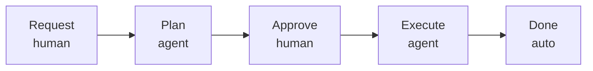

# Spec-Driven Development (SDD) Boilerplate

A ready-to-adopt folder structure and workflow for building software projects with AI agents under human supervision. Clone this repo, replace the example content with your project's details, and start shipping features through a structured request → plan → approve → execute pipeline.

## What Is Spec-Driven Development?

SDD is a development model where:

1. **Humans define _what_ to build** — through task requests and by resolving open questions.
2. **Agents figure out _how_ to build it** — through detailed, step-by-step implementation plans.
3. **Humans approve before anything is built** — every plan goes through a review gate.
4. **Agents execute approved plans** — mechanically following steps that were already vetted.

No code is written without an approved plan. No plan is approved without human review. This creates a clear audit trail and prevents agents from making unsupervised architectural decisions.

## Why Use This?

- **Consistency:** Every feature follows the same pipeline, regardless of which agent or IDE you use.
- **Control:** The open questions mechanism forces agents to surface ambiguities instead of guessing. You make the decisions; they do the work.
- **Context:** The `agent-specs/` directory gives every agent conversation the same foundational knowledge about your project — no more re-explaining your architecture in every chat.
- **History:** Completed plans and requests in `done/` serve as an audit trail of what was built, why, and how.
- **Onboarding:** New contributors (human or AI) can read the specs and development guide to get up to speed without a walkthrough.

## Repository Structure

```
sdd-boilerplate/
├── agent-development/                  ← Agent-facing pipeline
│   ├── agent-specs/                    ← Project context (read by every agent)
│   │   ├── agent-instructions.md       ← Coding standards (customize for your stack)
│   │   ├── agent-workflow.md           ← Execution rules (system-level, rarely customized)
│   │   ├── application-overview.md     ← What the app does (replace with yours)
│   │   ├── architecture-breakdown.md   ← Folder structure, patterns, tech stack (replace)
│   │   └── git-workflow.md             ← Branching, commits, versioning (customize)
│   ├── pending/                        ← Task requests waiting to be planned
│   │   └── _TEMPLATE-request.md
│   ├── plans/                          ← All plan folders (status tracked in manifest.yaml)
│   │   └── _templates/
│   │       ├── manifest.yaml           ← Task state, stages, approval tracking
│   │       ├── specification.md        ← Human-readable plan overview
│   │       └── stage.md               ← Per-stage instruction template
│   └── done/                           ← Completed work (archive)
│       ├── plans/
│       ├── requests/
│       └── quick-fixes/
│
├── user-development/                   ← Human-facing development assets
│   ├── DEVELOPMENT-GUIDE.md            ← Full workflow documentation
│   ├── STATUS-REFERENCE.md             ← All status enums, transitions, and Mermaid diagrams
│   └── prompts/                        ← Copy-paste prompts for agent conversations
│       ├── 0-bootstrap-specs.md        ← "Bootstrap agent-specs/ for a new project"
│       ├── 1-plan-task.md              ← "Plan this task request"
│       ├── 2-execute-plan.md           ← "Execute this approved plan"
│       ├── 3-create-request.md         ← "Interactive request discovery and creation"
│       └── 4-quick-fix.md             ← "Make a small, obvious change and log it"
│
└── README.md                           ← You are here
```

## Quick Start

Follow these steps to adopt SDD for a new project. The whole process takes about 10 minutes.

### Step 1: Clone and Reset Git History

```bash
git clone <this-repo-url> my-new-project
cd my-new-project
rm -rf .git && git init
```

### Step 2: Delete Example Content

The boilerplate ships with example content for a fictional NestJS project. Remove it so you start clean:

```bash
# Delete example pending requests (NestJS-specific — not relevant to your project)
rm agent-development/pending/1-docker-infrastructure.md
rm agent-development/pending/2-config-and-dotenv.md
rm agent-development/pending/3-makefile-and-dev-commands.md
```

> **Keep the `done/` examples.** The completed plan in `agent-development/done/plans/0-project-bootstrapping/` and its matching request in `agent-development/done/requests/` serve as reference for the level of detail that works well.

### Step 3: Bootstrap Your Agent Specs (Use Prompt 0)

1. Open a new agent conversation in your IDE (Cursor, Windsurf, Copilot, Zed, etc.).
2. Paste the contents of **`user-development/prompts/0-bootstrap-specs.md`**.
3. Replace `<PROJECT_DESCRIPTION>` with a description of your project.
4. If you have an existing codebase, point the agent at the source tree.
5. The agent generates all five `agent-specs/` files in one shot.
6. **Review the generated files.**

| File | What It Contains | How Often You Customize |
|---|---|---|
| `agent-instructions.md` | Coding standards, dos/don'ts, naming, testing, error handling | **Frequently** — evolves with your project |
| `agent-workflow.md` | Execution rules, blast radius, commit timing, spec/doc update rules | **Rarely** — system-level |
| `application-overview.md` | What the app does, core workflows, UX/DX goals | **Occasionally** |
| `architecture-breakdown.md` | Directory tree, design patterns, tech stack, module deps | **Per-task** |
| `git-workflow.md` | Branching strategy, commit format, ticket ID pattern, versioning | **Once at setup** |

### Step 4: Make Your First Commit

```bash
git add -A
git commit -m "chore: initialize SDD boilerplate with project specs"
```

### Step 5: Create Your First Task Request

Option A — write it yourself using `agent-development/pending/_TEMPLATE-request.md`.

Option B — paste `user-development/prompts/3-create-request.md` into an agent conversation and describe what you want.

### Step 6: Plan, Approve, Execute



1. **Plan:** Paste `user-development/prompts/1-plan-task.md` into an agent conversation.
2. **Approve:** Review `specification.md`. Resolve open questions. Set `approval.status: approved` in `manifest.yaml`.
3. **Execute:** Paste `user-development/prompts/2-execute-plan.md` into a new conversation.

For the full workflow documentation, read `user-development/DEVELOPMENT-GUIDE.md`.

## Key Concepts

### Approval is Field-Based

Plans stay in `agent-development/plans/` throughout their lifecycle. Approval is signaled by setting `approval.status: approved` in `manifest.yaml` — not by moving files between folders. This keeps git history clean and file references stable.

### Plans Are Folders, Not Files

Each plan is a folder containing a `manifest.yaml` (authoritative state), a `specification.md` (human overview), and numbered stage files. This allows large tasks to be broken into focused, independently verifiable stages.

### The Open Questions Mechanism

When a planning agent encounters ambiguity, it writes up the question in `specification.md` instead of guessing. The human resolves all questions before approving. See the [Development Guide](user-development/DEVELOPMENT-GUIDE.md#the-open-questions-mechanism).

### Blast Radius Constraints

Each stage file declares which files the agent may read and write. Anything not listed is out of scope. This prevents unscoped changes.

### Source Code Is the Source of Truth

Agents read actual source code to understand the current state. Specs provide context and conventions, but if there's a conflict, the code wins.

## Understand the Two Tracks

| Track | When to Use | Prompt | Audit Trail |
|---|---|---|---|
| **Full Pipeline** | Features, refactors, anything with design decisions or 4+ files | `1-plan-task.md` → `2-execute-plan.md` | Request + plan folder in `done/` |
| **Quick Fix** | Small, mechanically obvious changes (1–3 files, no ambiguity) | `4-quick-fix.md` | Log file in `done/quick-fixes/` |

## Adapting to Your Stack

This boilerplate is **language-agnostic** at the workflow level. The pipeline, templates, prompts, and directory structure work with any technology stack.

### What to Keep vs. Replace

| File / Directory | Keep or Replace? | Notes |
|---|---|---|
| `user-development/` | **Keep as-is** | Prompts, guides, and templates are universal |
| `agent-development/agent-specs/agent-workflow.md` | **Keep as-is** | System-level execution rules |
| `agent-development/agent-specs/` (other 4 files) | **Replace** (via Prompt 0) | Must reflect YOUR project |
| `agent-development/pending/*.md` (examples) | **Delete** | Stack-specific examples |
| `agent-development/done/` | **Keep** (as reference) | Delete later once you have your own |
| `agent-development/plans/_templates/` | **Keep as-is** | Universal plan structure |

## FAQ

**Q: Does this work with [Cursor / Windsurf / Copilot / Claude / Zed / etc.]?**
A: Yes. The prompts are plain Markdown pasted into any agent conversation.

**Q: Can I skip the planning step for small tasks?**
A: Use the **quick fix track** for truly trivial changes. For anything with design decisions, use the full pipeline.

**Q: What if I disagree with the agent's plan?**
A: Modify the plan directly before approving. Set `approval.status: approved` only when satisfied.

**Q: Do all plans need multiple stages?**
A: No. Small tasks can have a single stage with spec/doc updates inline.

**Q: What happens if execution is interrupted?**
A: `manifest.yaml` tracks `current_stage`. The agent resumes from where it left off.

**Q: Should I commit the `done/` files?**
A: Yes. They serve as project history.

## License

MIT — use this however you like.
