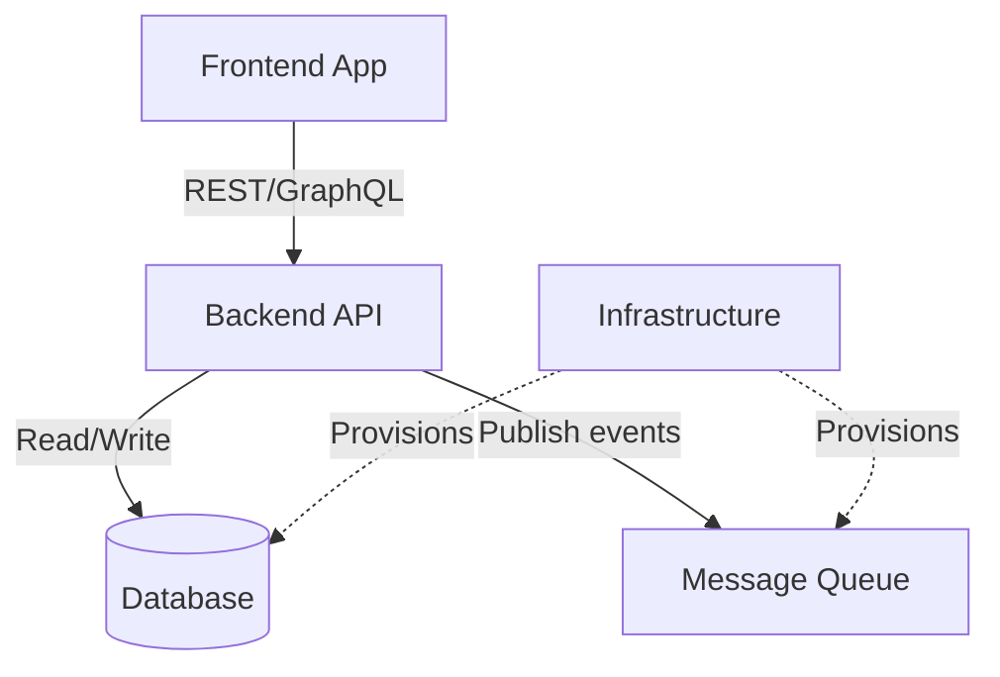

# System Overview

> **Last updated:** YYYY-MM-DD
> **Repos managed:** _See `config/repos.yaml` for the full registry_

## Service Topology

_Replace this diagram with your actual service architecture. This is generated during hub bootstrap (Prompt 0)._

## Service Descriptions

| Service | Repo | Role | Tech Stack |
|---------|------|------|-----------|
| Frontend App | `frontend-repo` | User-facing UI | React, TypeScript |
| Backend API | `api-repo` | Business logic, data access | NestJS, TypeScript |
| Infrastructure | `infra-repo` | IaC, provisioning | Terraform, HCL |

## Communication Patterns

_Describe how services communicate: synchronous (REST, GraphQL), asynchronous (queues, events), shared databases, etc._

### Synchronous

- Frontend → API: REST/GraphQL over HTTPS

### Asynchronous

- API → Queue: Event publishing (SQS/SNS/Kafka)

### Shared Resources

- Database: PostgreSQL (managed by infra)
