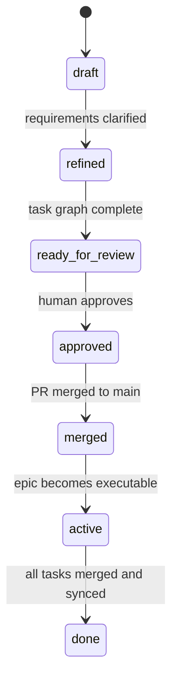
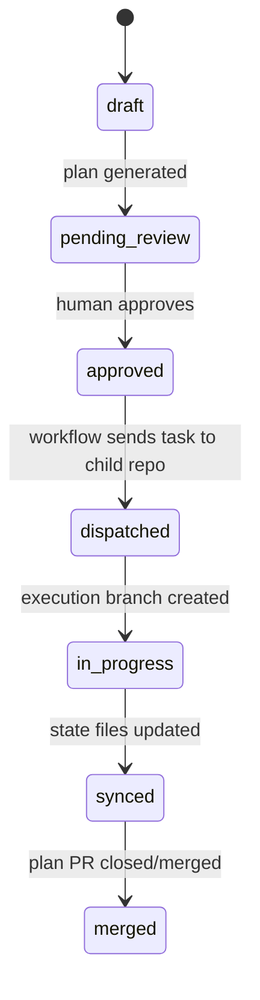
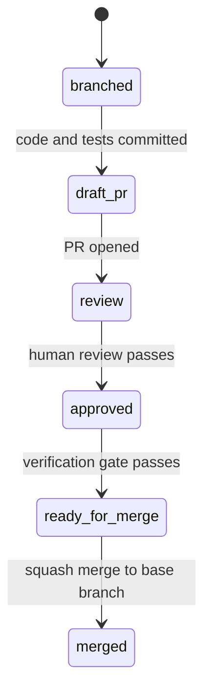

# Git Workflow — SDD Multirepo Hub

> **Scope:** Applies to the hub repo and every managed child repo unless a repo-level `sdd/agent-specs/git-workflow.md` overrides a specific rule.

This hub uses three branch families with distinct purposes:

1. **Epic branches** hold high-level planning only.
2. **Plan branches** hold task-level implementation plans only.
3. **Execution branches** live in child repos and hold code changes only.

## Branch Families

| Branch family | Pattern | Where it lives | Purpose |
|---|---|---|---|
| Epic | `epic/<ticket-id>_<name>` | Hub repo | Draft the epic, refine requirements, and generate `task-graph.md` |
| Plan | `plan/<ticket-id>_<name>` | Hub repo | Generate the task-specific implementation plan and execution metadata |
| Execution | `<type>/<ticket-id>_<name>` | Child repo | Write the actual code, tests, and repo-local docs |

### Allowed branch types

- `epic` and `plan` are reserved for hub coordination.
- Child repos use standard branch types: `feat`, `fix`, `chore`, `refactor`, `docs`, `ci`, `hotfix`.

## Epic Branch Lifecycle

Epic branches are the coordination surface for product discovery and task decomposition.



### What lives on an epic branch

- `epic.md`
- `task-graph.md`
- `delivery.yaml`
- request shells under `requests/`

### What must not live on an epic branch

- Child repo code changes
- Execution branch commits
- Repo-local implementation details that belong in a plan

### Merge rule

Once approved, the epic PR is merged into `main`. The merge is the handoff point from planning to execution.

### Automation

- `epic-approval.yml`
  - Triggers when an epic PR is approved
  - Auto-merges the epic PR
  - Reads `task-graph.md`
  - Creates GitHub Issues and Jira tickets
  - Updates task tracking state through `bin/sync-state.js`

## Plan Branch Lifecycle

Plan branches turn approved task requests into concrete implementation plans.



### What lives on a plan branch

- `agent-development/plans/<task>/manifest.yaml`
- `agent-development/plans/<task>/specification.md`
- `agent-development/plans/<task>/<n>-*.md` stage files
- hub-side tracking updates in `task-graph.md` and `delivery.yaml`

### What must not live on a plan branch

- Implementation code in a child repo
- Broad design speculation not captured in the plan
- Hidden task state that is not mirrored in the hub manifest files

### Merge rule

Plan PR approval authorizes execution. The workflow dispatches the task to the target child repo before the plan branch is closed out.

### Automation

- `plan-execution-trigger.yml`
  - Triggers when a plan PR is approved
  - Reads the plan manifest
  - Resolves the target child repo from `target_repo`
  - Sends `repository_dispatch` to the child repo
  - Marks hub tracking state as dispatched/in-progress

## Execution Branch Lifecycle

Execution branches are repo-local and contain only the actual implementation.



### Naming

Execution branches use the repo's configured base branch and standard branch type:

```text
feat/PROJ-123_add-awards-endpoint
fix/PROJ-456_null-check
chore/PROJ-789_update-dependencies
```

### What lives on an execution branch

- Source code
- Tests
- Repo-local docs that belong with the implementation
- Plan-linked PR metadata

### What must not live on an execution branch

- Epic-level planning files
- Hub-only coordination state
- Unrelated cleanup outside the declared blast radius

### Automation

- `ai-verification-gate.yml`
  - Triggers when a child repo PR is opened or updated
  - Compares the diff to the epic + plan context
  - Uses GitHub Models for off-track detection
  - Opens a follow-up iteration issue if the work diverges

## PR Conventions

- Draft PRs are the default starting state.
- PR titles follow conventional commit style: `<type>(<scope>): <description> [TICKET-ID]`
- Each plan stage should map to one coherent implementation change.
- Cross-repo PRs must link to each other in their descriptions.

### Cross-linking

- Hub plan PR description includes:
  - `**Target repo PR:** <org>/<repo>#<number>`
- Child repo PR description includes:
  - `**Hub plan PR:** <org>/<hub-repo>#<number>`

## State Synchronization

The hub is the single source of truth for cross-repo status.

- `task-graph.md` tracks task status, ticket IDs, and dependencies
- `delivery.yaml` tracks PR nodes, merge order, and deployment notes
- `bin/sync-state.js` updates both files from workflow events

## Merge Strategy

- Default PR merge strategy is squash merge.
- Rebase or merge commits are only used when a repo's rules explicitly require them.
- Deployment order follows `delivery.yaml`, not branch naming.

## Automation Reference

### Hub Workflows (`.github/workflows/`)

| Workflow | Trigger | What it does |
|----------|---------|-------------|
| `validate.yml` | PR opened/sync on any branch | Validates YAML, frontmatter, manifest schema, branch naming, and cross-references |
| `epic-approval.yml` | PR review approved (`epic/` branch) | Creates GitHub Issues + Jira tickets, sets epic to `active`, squash-merges the PR, transitions Jira epic |
| `plan-execution-trigger.yml` | PR review approved (`plan/` branch) | Reads plan manifest, resolves target repo, dispatches `task-assigned` event to child repo with branch type and SDD mode |
| `ai-verification-gate.yml` | `repository_dispatch: verify-pr` | Compares child repo PR diff against epic + plan using AI. Posts advisory comment. Never blocks. Skips gracefully on API failure. AI-assisted blast radius check |
| `post-merge-sync.yml` | PR closed + merged | Updates `task-graph.md` → `done`, `delivery.yaml` → `merged`, transitions Jira ticket, checks epic completion |
| `pr-lifecycle.yml` | PR opened/sync/ready | Labels PRs by type, posts lifecycle guidance, adds cross-reference reminders |
| `target-status-events.yml` | `repository_dispatch` from child repo | Applies status changes to hub tracking files, validates transitions, detects epic completion |
| `epic-completion.yml` | `workflow_call` / `workflow_dispatch` | Checks if all tasks are done and all PRs merged, notifies on epic issues, runs dry-run archive |
| `guardrails.yml` | PR opened/sync on `main` | Advisory checks: branch naming, PR cross-references, blast radius, title conventions. Never blocks merge |

### Reusable Workflows (called by target repos)

| Workflow | How to use |
|----------|-----------|
| `receive-task.yml` | Called by target repo on `repository_dispatch: task-assigned`. Creates execution branch, `.sdd/context.yaml`, and draft PR with cross-references |
| `notify-hub-verification.yml` | Called by target repo on PR open/sync. Reads `.sdd/context.yaml` (fallback: PR body regex), dispatches `verify-pr` to hub |

### Installing in Target Repos

Run `bin/dev install-workflows <repo-name>` to copy minimal caller workflows into a target repo's `.github/workflows/` directory. The caller workflows reference the hub's reusable workflows via `uses: <org>/<hub>/.github/workflows/...@main`.

**Prerequisites for target repos:**
1. Set variable `HUB_REPO` = `<org>/<hub-repo-name>`
2. Set secret `HUB_CROSS_REPO_TOKEN` = PAT with `repo` + `workflow` scopes
3. The branch naming pattern in `config/teams.yaml` must match what the hub expects

### Self-SDD Repos (`has_own_sdd: true`)

Repos that manage their own SDD don't use hub plan branches. The entire lifecycle (plan + code + docs) lives in a single `feat/` branch + PR. The target repo dispatches `pr-status-change` events to the hub to keep tracking files in sync. The hub's `target-status-events.yml` handles these events.

## Guardrails

All guardrails are **advisory** — they surface issues in PR comments and check annotations but never block merging. Human reviewers remain the final gate.

| Guardrail | Workflow | What it checks |
|-----------|----------|---------------|
| Branch naming | `guardrails.yml`, `validate.yml` | Branches must match `epic/<TICKET>_<desc>`, `plan/<TICKET>_<desc>`, or `<type>/<TICKET>_<desc>` |
| PR cross-references | `guardrails.yml`, `pr-lifecycle.yml` | Plan PRs must link target repo PR; execution PRs must link hub plan PR and include Epic ID / Task ID |
| Blast radius (deterministic) | `guardrails.yml` | Plan branches must only touch hub tracking paths; execution branches checked against manifest-declared file scope |
| Blast radius (AI-assisted) | `ai-verification-gate.yml` | AI compares changed files against plan manifest's `context_files` + `output_files`, flags unexpected changes |
| Title conventions | `guardrails.yml`, `pr-lifecycle.yml` | PR titles should follow conventional commit format with ticket ID |
| Status transitions | `target-status-events.yml` | Status changes validated against canonical state machine in `STATUS-REFERENCE.md` before writing |
| Config completeness | `install-workflows` command | Verifies target repo config before installing workflows |

### Overriding Guardrails

Guardrails can be silenced per-PR by adding labels:
- `skip-guardrails` — skips all guardrail checks
- `skip-blast-radius` — skips blast radius checking

## Rules of Thumb

1. Planning branches stay in the hub.
2. Execution branches stay in the target child repo.
3. Hub files describe intent and orchestration.
4. Child repos contain the code.
5. Any status change must be reflected back into `task-graph.md` or `delivery.yaml`.
6. Guardrails advise — humans decide.
