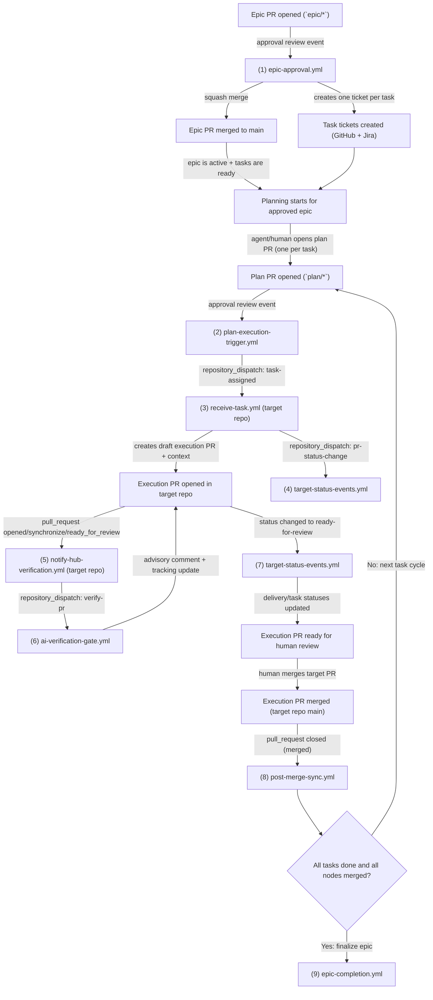

# SDD Workflow Reference

> Complete catalog of every GitHub Actions workflow in this hub, including triggers,
> consumed secrets, required setup, and the role each plays in the SDD automation lifecycle.

---

## Overview

The hub ships **11 workflows** organized into three groups:

| Group | Workflows | Runs where |
|-------|----------|------------|
| **Guardrails** | `validate`, `guardrails`, `preflight-check` | Hub repo |
| **Orchestration** | `epic-approval`, `plan-execution-trigger`, `ai-verification-gate`, `post-merge-sync`, `target-status-events`, `epic-completion` | Hub repo |
| **Reusable** | `receive-task`, `notify-hub-verification` | Called by target repos |

Plus **2 caller templates** in `.github/workflow-templates/` for target repos that can't use reusable workflows directly.

---

## Required Setup

### Hub Repo

| Secret/Variable | Required | Purpose |
|-----------------|----------|---------|
| `HUB_CROSS_REPO_TOKEN` | **Yes** | PAT with `repo` + `workflow` scopes. Used to dispatch events to target repos and read PR data across repos |
| `HUB_INTEGRITY_SECRET` | No | Shared secret for HMAC event integrity. Same value must be set in all target repos |
| `JIRA_BASE_URL` | No | Jira Cloud instance URL (e.g., `https://your-org.atlassian.net`). If absent, Jira integration is skipped |
| `JIRA_USER_EMAIL` | No | Jira user email for basic auth |
| `JIRA_API_TOKEN` | No | Jira API token |

| Variable | Required | Purpose |
|----------|----------|---------|
| `HUB_REPO` | **Yes** | Hub repo in `org/repo-name` format. Used by target repos to reference reusable workflows |

### Target Repos

| Secret/Variable | Required | Purpose |
|-----------------|----------|---------|
| `HUB_CROSS_REPO_TOKEN` | **Yes** | Same PAT — enables dispatches back to hub |
| `HUB_INTEGRITY_SECRET` | No | Same value as hub |
| `HUB_REPO` | **Yes** | Hub repo reference for `uses:` calls |

**Installation:** Run `bin/dev install-workflows <repo-name>` from the hub to copy caller workflows into a target repo.

---

## Workflow Catalog

### `validate.yml`

**What:** Validates YAML syntax, markdown frontmatter, manifest schema, branch naming, and cross-references.

| Field | Value |
|-------|-------|
| **Trigger** | `pull_request: opened, synchronize, ready_for_review` on any branch, non-draft |
| **Permissions** | `contents: read`, `checks: write` |
| **Secrets** | `GITHUB_TOKEN` (auto) |
| **Fails?** | Yes — `core.setFailed()` on YAML/schema errors |
| **Cross-refs?** | Warns if plan PRs miss target repo link, exec PRs miss hub link |

**Checks performed:**
- Changed YAML files parse correctly
- `manifest.yaml` files have `plan_metadata`, `task_id`, `task_name`, `status`
- Valid status values for plans
- Markdown frontmatter in epic/request docs is well-formed
- `delivery.yaml` has `nodes` and `epic_id`
- Branch naming against expected prefixes (advisory)
- Cross-references in PR descriptions (advisory)

---

### `guardrails.yml`

**What:** Advisory guardrails posted as **check runs** — visible in branch protection UI but never blocking.

| Field | Value |
|-------|-------|
| **Trigger** | `pull_request: opened, synchronize, ready_for_review` on `main` |
| **Permissions** | `contents: read`, `checks: write` |
| **Secrets** | `GITHUB_TOKEN` (auto) |
| **Fails?** | Never — always `neutral` on issues |

**Check 1: Branch Naming** — validates against `epic/<TICKET>_<desc>`, `plan/<TICKET>_<desc>`, or `<type>/<TICKET>_<desc>`.

**Check 2: Cross-References** — verifies `**Target repo PR:**` on plan branches and `**Hub plan PR:**` + `Epic ID:` + `Task ID:` on execution branches.

**Check 3: Blast Radius** — plan branches should only touch `epics/`, `agent-development/`, `fallback-sdd/`, `documentation/`, `.github/`. Execution branches shouldn't touch hub tracking files.

**Check 4: Title Convention** — validates conventional commit format and ticket ID.

---

### `preflight-check.yml`

**What:** Validates config completeness and secret availability before any automation runs.

| Field | Value |
|-------|-------|
| **Trigger** | `pull_request: opened, synchronize, ready_for_review` on any branch |
| **Permissions** | `contents: read`, `checks: write` |
| **Secrets** | `GITHUB_TOKEN` (auto) |
| **Fails?** | Never — `neutral` on missing secrets (they might be configured at org level) |

**Check 1: Config Validation** — verifies `config/repos.yaml` has `repositories` key, `config/teams.yaml` has `active_team`, `project_key`, `branching`. Also runs per-PR context checks (cross-references on plan/exec PRs, branch naming).

**Check 2: Secrets Availability** — checks `HUB_CROSS_REPO_TOKEN` (required), `JIRA_*` (optional), `HUB_REPO` variable (required). Reports which are missing and what features will be skipped.

---

### `epic-approval.yml`

**What:** The gateway from epic planning to execution. Runs on epic PR approval — creates tickets, transitions Jira, and merges.

| Field | Value |
|-------|-------|
| **Trigger** | `pull_request_review: submitted` on `main`, review `approved`, branch starts with `epic/` |
| **Permissions** | `contents: write`, `pull-requests: write`, `issues: write` |
| **Secrets** | `GITHUB_TOKEN`, `JIRA_*` (optional) |
| **Fails?** | Yes — on unresolvable epic or Jira config errors |

**Steps:**
1. **Discover epic context** — resolves the epic directory from branch name (matches `ticket_id` or directory slug)
2. **Create GitHub Issues + Jira tickets** — one per task in `task-graph.md`. Skips if `jira_ticket` already exists (deduplication)
3. **Record ticket IDs** — writes `jira_ticket` and `gh_issue` back into `task-graph.md` frontmatter
4. **Commit tracking updates** — pushes the ticket mapping to the epic branch
5. **Set epic status to `active`** — updates `epic.md` frontmatter
6. **Transition Jira epic** — moves the Jira epic to "In Progress" if `jira_epic` field exists
7. **Squash-merge** — merges the epic branch into `main`

**Jira details:** Creates tasks using Jira Cloud REST API (`/rest/api/3/issue`). If Jira secrets are missing, this step is skipped silently. Tickets use the `task` issue type from `config/teams.yaml`.

---

### `plan-execution-trigger.yml`

**What:** Dispatches an approved plan to the target repo for execution. The orchestration handoff point.

| Field | Value |
|-------|-------|
| **Trigger** | `pull_request_review: submitted` on `main`, review `approved`, branch starts with `plan/` |
| **Permissions** | `contents: write`, `pull-requests: write` |
| **Secrets** | `GITHUB_TOKEN`, `HUB_CROSS_REPO_TOKEN`, `HUB_INTEGRITY_SECRET` (optional) |
| **Fails?** | Yes — on unresolvable plan, target repo, or dispatch failure |

**Steps:**
1. **Generate correlation ID** and start audit log entry
2. **Discover plan context** — resolves `manifest.yaml` from `agent-development/plans/` or `fallback-sdd/`
3. **Read repo config** — resolves target repo from `config/repos.yaml`, determines `has_own_sdd`, reads branch type from `teams.yaml`
4. **Mark task activated** — updates `task-graph.md` task → `activated` and `delivery.yaml` node → `branched`
5. **Dispatch to target repo** — sends `repository_dispatch: task-assigned` with full context, correlation ID, and HMAC integrity token
6. **Commit tracking updates** — pushes status changes to the plan branch
7. **Comment on plan PR** — posts dispatch summary including correlation ID
8. **Audit workflow end** — writes final audit entry

**Payload sent to target repo:**
```
epic_id, task_id, task_name, hub_repo, plan_branch, plan_pr_number,
plan_dir, manifest_path, target_repo_key, target_repo_full_name,
execution_branch, branch_type, has_own_sdd, correlation_id, integrity_token
```

---

### `receive-task.yml` _(reusable, called by target repos)_

**What:** Receives the dispatched task in the target repo. Creates the execution branch, `.sdd/context.yaml`, and a draft PR.

| Field | Value |
|-------|-------|
| **Trigger** | `workflow_call` (called by target repo's lightweight listener) |
| **Permissions** | `contents: write`, `pull-requests: write` |
| **Secrets** | `HUB_CROSS_REPO_TOKEN`, `HUB_INTEGRITY_SECRET` (optional) |
| **Fails?** | Yes — on branch/PR creation failure |

**Steps:**
1. **Verify integrity token** — validates HMAC if `HUB_INTEGRITY_SECRET` is configured. Logs warning on mismatch (does not block)
2. **Checkout and create execution branch** — uses configured branch type + ticket ID from the payload
3. **Create `.sdd/context.yaml`** — structured metadata file committed to the branch. Contains `epic_id`, `task_id`, `task_name`, `hub_repo`, `hub_plan_branch`, `hub_plan_pr`, `target_repo_key`, timestamp
4. **Open draft PR** — creates a draft PR with cross-reference metadata in the body (includes `**Hub plan PR:**` link)
5. **Notify hub** — dispatches `pr-status-change` event back to hub so tracking files stay in sync

**Caller setup in target repo:**
```yaml
# .github/workflows/receive-task.yml (in target repo)
on:
  repository_dispatch:
    types: [task-assigned]
jobs:
  call:
    uses: ${{ vars.HUB_REPO }}/.github/workflows/receive-task.yml@main
    with:
      epic_id: ${{ github.event.client_payload.epic_id }}
      task_id: ${{ github.event.client_payload.task_id }}
      task_name: ${{ github.event.client_payload.task_name }}
      hub_repo: ${{ github.event.client_payload.hub_repo }}
      hub_plan_branch: ${{ github.event.client_payload.plan_branch }}
      hub_plan_pr: ${{ github.event.client_payload.plan_pr_number }}
      execution_branch: ${{ github.event.client_payload.execution_branch }}
      plan_dir: ${{ github.event.client_payload.plan_dir }}
      target_repo_key: ${{ github.event.client_payload.target_repo_key }}
    secrets:
      HUB_CROSS_REPO_TOKEN: ${{ secrets.HUB_CROSS_REPO_TOKEN }}
      HUB_INTEGRITY_SECRET: ${{ secrets.HUB_INTEGRITY_SECRET }}
```

---

### `notify-hub-verification.yml` _(reusable, called by target repos)_

**What:** When a PR is opened or updated in a target repo, notifies the hub to run AI verification against the plan.

| Field | Value |
|-------|-------|
| **Trigger** | `workflow_call` (called by target repo's lightweight listener on PR events) |
| **Permissions** | `contents: read` |
| **Secrets** | `HUB_CROSS_REPO_TOKEN`, `HUB_INTEGRITY_SECRET` (optional) |
| **Fails?** | Yes — on dispatch failure |

**Steps:**
1. **Read SDD context** — prefers `.sdd/context.yaml` (structured). Falls back to parsing `Epic ID:` / `Task ID:` from PR body
2. **Dispatch verification to hub** — sends `repository_dispatch: verify-pr` with full context, correlation ID, and HMAC integrity token

**Caller setup in target repo:**
```yaml
# .github/workflows/notify-hub-verification.yml (in target repo)
on:
  pull_request:
    types: [opened, synchronize, ready_for_review]
    branches: [main]
jobs:
  call:
    if: startsWith(github.event.pull_request.head.ref, 'feat/') || startsWith(...)
    uses: ${{ vars.HUB_REPO }}/.github/workflows/notify-hub-verification.yml@main
    with:
      hub_repo: ${{ vars.HUB_REPO }}
    secrets:
      HUB_CROSS_REPO_TOKEN: ${{ secrets.HUB_CROSS_REPO_TOKEN }}
      HUB_INTEGRITY_SECRET: ${{ secrets.HUB_INTEGRITY_SECRET }}
```

---

### `ai-verification-gate.yml`

**What:** Compares child repo PR diff against the epic and plan using GitHub Models (GPT-4o). Advisory only.

| Field | Value |
|-------|-------|
| **Trigger** | `repository_dispatch: verify-pr` |
| **Permissions** | `contents: write`, `pull-requests: write`, `checks: write` |
| **Secrets** | `HUB_CROSS_REPO_TOKEN`, `GITHUB_TOKEN` |
| **Fails?** | Never — skips gracefully on API failure |

**Steps:**
1. **Deterministic pre-check** — skips AI call for config-only changes (<50 additions). Detects blast radius issues by comparing changed files against manifest-declared `context_files` + `output_files`
2. **AI verification** (3 retries with 10s/30s/90s backoff):
   - Sends epic + task-graph + plan manifest + plan spec + PR diff + blast radius notes to `models.github.ai`
   - Model returns `{"verdict": "aligned" | "off_track", "summary": "...", "deviations": [...], "recommended_actions": [...]}`
   - On all retries exhausted: posts "verification skipped" comment, does NOT block
3. **Post results** — posts advisory comment on child repo PR. Updates `task-graph.md` status (`in-progress` on aligned, marks delivery `in-progress`)
4. **Create advisory issue** — if off-track, creates labeled `advisory-iteration` issue in hub (not blocking)
5. **Commit tracking** — pushes status updates to default branch

**Graceful degradation:** If the API is unreachable after 3 attempts, the workflow exits successfully with a note. PRs are never blocked.

---

### `post-merge-sync.yml`

**What:** After any PR merges, updates all tracking files, transitions Jira, and checks if the epic is complete.

| Field | Value |
|-------|-------|
| **Trigger** | `pull_request: closed` on `main`, merged == true |
| **Permissions** | `contents: write`, `pull-requests: write` |
| **Secrets** | `GITHUB_TOKEN`, `HUB_CROSS_REPO_TOKEN`, `JIRA_*` (optional) |
| **Fails?** | Non-critical failures are caught — archive failure is noted but doesn't fail the workflow |

**Steps (branch-type aware):**

**Plan branch merge:**
1. Extract `epic_id` + `task_id` from PR body or branch
2. Mark `task-graph.md` task → `done`
3. Mark `delivery.yaml` node → `merged`
4. Commit and push to default branch

**Epic branch merge:**
1. Set `epic.md` status to `active`
2. Commit and push

**Execution branch merge (target repo PR):**
1. If PR body has `**Hub plan PR:**` link, comment on the hub plan PR that the target PR merged
2. Transition Jira ticket to Done (if Jira configured)
3. Run `checkEpicCompletion()` — if all tasks done + all nodes merged, runs `bin/dev wf:archive <epic>` (falls back to dry-run comment on failure)

---

### `target-status-events.yml`

**What:** Receives status change events from target repos and updates hub tracking files with validated transitions.

| Field | Value |
|-------|-------|
| **Trigger** | `repository_dispatch: pr-status-change, task-status-change` |
| **Permissions** | `contents: write`, `pull-requests: write` |
| **Secrets** | `GITHUB_TOKEN` |
| **Fails?** | Yes — on unresolvable epic/task or write failures |

**Steps:**
1. **Validate transition** — checks against canonical state machine in `STATUS-REFERENCE.md` via `bin/sync-state.js validate-status`. Rejects invalid transitions with reason logged. Terminal states (`done`, `merged`, `abandoned`, `skipped`) cannot transition further
2. **Apply status change** — updates `delivery.yaml` node status and `task-graph.md` task status. Maps PR-centric statuses (`branched`, `draft-pr`, `ready-for-review`) to task statuses (`in-progress`, `done`)
3. **Check epic completion** — if all tasks are `done`/`skipped` and all nodes are `merged`/`abandoned`, flags for archive
4. **Commit** — pushes updates to default branch
5. **Notify** — if epic complete, comments on the linked epic issue

**Supported payload:**
```json
{
  "epic_id": "1",
  "task_id": "3",
  "status": "ready-for-review",
  "layer": "delivery",
  "pr_url": "https://github.com/org/repo/pull/42",
  "pr_number": "42",
  "branch": "feat/PROJ-123_add-endpoint",
  "repository": "org/target-repo"
}
```

---

### `epic-completion.yml`

**What:** Checks if an epic is complete and notifies. Can be called by other workflows or triggered manually.

| Field | Value |
|-------|-------|
| **Trigger** | `workflow_call` (by `post-merge-sync`) or `workflow_dispatch` (manual) |
| **Permissions** | `contents: read`, `issues: write` |
| **Secrets** | `GITHUB_TOKEN` |
| **Fails?** | No — archive attempt is `continue-on-error` |

**Steps:**
1. **Check completion** — runs `bin/sync-state.js check-completion <epic-id>`. Returns `complete`, `taskCount`, `doneTasks`, `skippedTasks`, `nodeCount`, `mergedNodes`, `abandonedNodes`, `incompleteTasks`, `unmergedNodes`
2. **Notify** — if complete, finds the epic tracking issue and posts a comment with stats and archive command
3. **Dry-run archive** — runs `bin/dev wf:archive <epic> --dry-run` to preview what would be moved

---

### `pr-lifecycle.yml`

**What:** Labels PRs by type and posts lifecycle guidance. Keeps the PR board organized and reminds about conventions.

| Field | Value |
|-------|-------|
| **Trigger** | `pull_request: opened, synchronize, ready_for_review, converted_to_draft` on `main` |
| **Permissions** | `pull-requests: write`, `checks: write` |
| **Secrets** | `GITHUB_TOKEN` |
| **Fails?** | No — purely advisory |

**Labels applied:**
- `epic` / `plan` / `execution` + branch type (`feat`, `fix`, etc.)
- `draft` if PR is in draft state
- `missing-cross-ref` if cross-reference link is absent
- `non-conventional-title` if title doesn't match conventional commit

**Guidance comments** posted on PR open/ready:
- Plan PRs: reminder to add target repo cross-reference
- Execution PRs: reminder to add hub plan cross-reference
- Ready plan PRs: checklist comment (target repo linked, manifest reviewed, verification passed)

---

## Complete Automation Lifecycle



---

## Verifying Setup

Run these checks to confirm everything is wired correctly:

```bash
# Validate config
bin/dev wf:validate

# Check what the hub sees
node bin/sync-state.js preflight --repo=example-api

# Check if target repo has workflows installed
bin/dev install-workflows example-api --dry-run

# View today's audit log
node bin/sync-state.js audit-summary

# List all known error codes
node bin/sync-state.js list-errors
```

## Adding a New Target Repo

1. Register in `config/repos.yaml` with `has_own_sdd`, `git_url`, `submodule_path`
2. Set `HUB_REPO` variable and `HUB_CROSS_REPO_TOKEN` secret in the target repo's Settings
3. Run `bin/dev install-workflows <repo-name>`
4. In the target repo, merge the caller workflows to the default branch
5. Verify: `bin/dev install-workflows <repo-name> --dry-run` should report no changes needed
