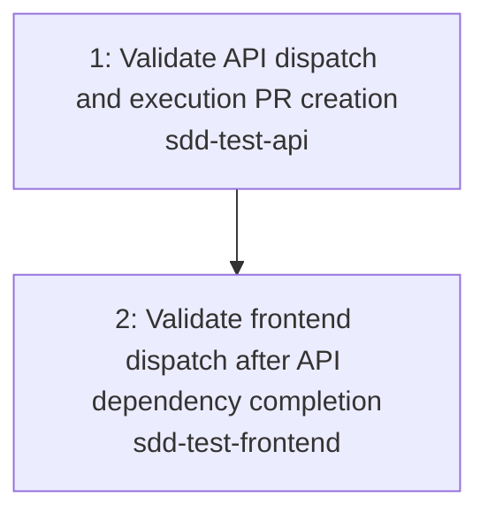

---
# ─────────────────────────────────────────────────────────────────────────────
# Task Graph Metadata (machine-parseable)
# ─────────────────────────────────────────────────────────────────────────────
epic_id: 1
epic_title: "Multi-Repo AI Workflow Smoke Test"
total_tasks: 2
last_updated: 2026-06-09
critical_path: [1, 2]

tasks:
  - id: 1
    title: "Validate API dispatch and execution PR creation"
    repo: "sdd-test-api"
    target_branch: null
    request_file: "1-api-smoke.md"
    jira_ticket: null
    gh_issue: null
    depends_on: []
    blocks: [2]
    status: draft
    complexity: 2
    assigned_to: null
  - id: 2
    title: "Validate frontend dispatch after API dependency completion"
    repo: "sdd-test-frontend"
    target_branch: null
    request_file: "2-frontend-smoke.md"
    jira_ticket: null
    gh_issue: null
    depends_on: [1]
    blocks: []
    status: draft
    complexity: 2
    assigned_to: null

negotiations: []
---

# Task Graph: Multi-Repo AI Workflow Smoke Test

> **Epic:** `../epic.md`
> **Total tasks:** 2
> **Last updated:** 2026-06-09

## Dependency Diagram

_Legend: Labels show task ID, title, and target repo. Arrows show "must complete before" relationships._

## Parallelization Notes

- Task 1 and Task 2 are intentionally serialized to validate hard dependency enforcement.
- Task 1 is the critical path bottleneck; it must complete before Task 2 can be dispatched.
- Cross-repo dependency: Task 1 (`sdd-test-api`) must complete before Task 2 (`sdd-test-frontend`) starts.
- Recommended activation order: 1 → 2.

## Jira Ticket Creation

_Jira tickets are created during task refinement/activation lifecycle._

## Activation Checklist

1. Ensure request files exist for task 1 and task 2.
2. Approve and merge epic PR to trigger plan PR creation.
3. Review `Plan Generated by Agent` checks on both plan PRs.
4. Merge plan 1 before plan 2 to satisfy dependency guards.
