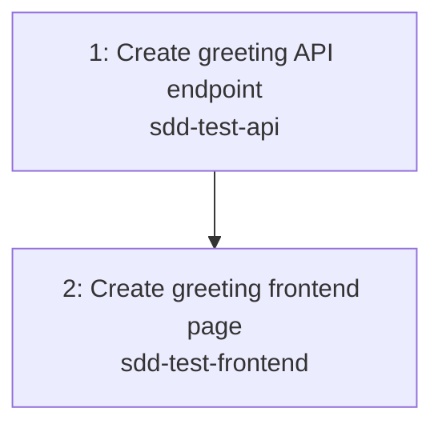

---
# ─────────────────────────────────────────────────────────────────────────────
# Task Graph Metadata (machine-parseable)
# ─────────────────────────────────────────────────────────────────────────────
epic_id: 1
epic_title: "Cross-repo greeting smoke test"
total_tasks: 2
last_updated: 2026-06-10
critical_path: [1, 2]

tasks:
  - id: 1
    title: "Create greeting API endpoint"
    repo: "sdd-test-api"
    target_branch: null
    request_file: "requests/1-create-greeting-api-endpoint.md"
    jira_ticket: null
    gh_issue: null
    depends_on: []
    blocks: [2]
    status: done
    complexity: 3
    assigned_to: null
  - id: 2
    title: "Create greeting frontend page"
    repo: "sdd-test-frontend"
    target_branch: null
    request_file: "requests/2-create-greeting-frontend-page.md"
    jira_ticket: null
    gh_issue: null
    depends_on: [1]
    blocks: []
    status: draft
    complexity: 3
    assigned_to: null

negotiations: []
---

# Task Graph: Cross-repo greeting smoke test

> **Epic:** `../epic.md`
> **Total tasks:** 2
> **Last updated:** 2026-06-09

## Dependency Diagram

_Legend: Task labels show ID, title, and target repo. Task 2 depends on the API contract and endpoint being established first._

## Parallelization Notes

- Task 1 is the foundation: it establishes the greeting contract and the endpoint.
- Task 2 should be refined once the contract is confirmed, then implemented after Task 1 lands.
- Critical path: Task 1 → Task 2.

## Jira Ticket Creation

_Jira tickets are created during task refinement (Prompt 7), NOT at breakdown time. This ensures each ticket is born with full requirements, acceptance criteria, and context._

### When to Create

- **Timing:** After each task is refined via Prompt 7 (status moves to `refined`).
- **Why not earlier?** At breakdown time, tasks are shells with minimal detail. Creating tickets then leads to barren tickets that need heavy updates later. The refinement session is where requirements become concrete and acceptance criteria become verifiable — that is the right moment to create the Jira record.
- **If Atlassian MCP is available:** The agent creates the ticket automatically during Prompt 7, following `config/jira-ticket-templates.md` for content structure.

### Content Standard

See `config/jira-ticket-templates.md` for the minimum ticket content standard. Every ticket must include at minimum: context (epic link, target repo, dependencies), goal statement, requirements list, acceptance criteria (3+ verifiable criteria), and dev notes (target repo, key files, patterns to follow).

### How to Create

1. During Prompt 7, after writing the refined request, the agent offers to create the Jira ticket.
2. The ticket is populated with full requirements, acceptance criteria, context, and dependency links.
3. The ticket ID is recorded in:
   - The request file's frontmatter (new `jira_ticket` field added)
   - The `task-graph.md` frontmatter for that task
4. Epic Link is set to the parent epic's Jira ticket.
5. "Blocks" / "Is Blocked By" relationships are set based on the dependency graph.

### Content Standard

See `config/jira-ticket-templates.md` for the full ticket content template. Every ticket must include at minimum:
- Context (epic link, target repo, dependencies including cross-repo, current state)
- Goal statement
- Requirements list
- Acceptance criteria (3+ verifiable criteria)
- Dev notes (target repo, key files, patterns to follow)

## Activation Checklist

1. Ensure the request has been refined (status: `refined` in request frontmatter)
2. Run `bin/dev dispatch <epic-id> <task-id>` to copy the request to the target repo
3. The command updates the task's status to `activated` automatically
4. Agent creates the branch in the target repo following conventions in `config/teams.yaml`
