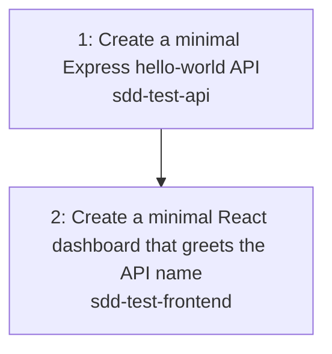

# Task Graph: API and React Code Generation MVP

> **Epic:** `../epic.md`
> **Total tasks:** 2
> **Last updated:** 2026-06-09

## Dependency Diagram

## Parallelization Notes

- Task 1 must land first so the API contract is available.
- Task 2 is blocked on Task 1 and verifies cross-repo dependency handling.
- Recommended activation order: 1 → 2.

