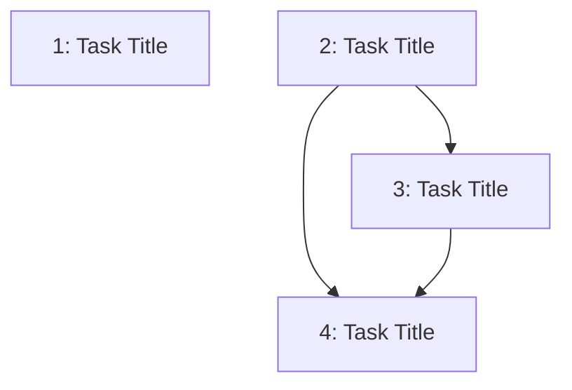

---
# ─────────────────────────────────────────────────────────────────────────────
# Task Graph Metadata (machine-parseable)
# ─────────────────────────────────────────────────────────────────────────────
epic_id: null           # Matches the epic's `id` field
epic_title: ""
total_tasks: 0
last_updated: null      # YYYY-MM-DD
critical_path: []       # Task IDs forming the longest dependency chain (e.g., [2, 3, 5])

tasks:
  - id: 1
    title: ""
    request_file: "requests/1-name.md"
    jira_ticket: null   # e.g., PROJ-123 — filled after ticket creation
    depends_on: []      # Task IDs this task depends on
    blocks: []          # Task IDs that depend on this task
    status: draft       # draft | refined | activated | planned | approved | in-progress | blocked | done | skipped
    complexity: null    # Fibonacci: 1 | 2 | 3 | 5 | 8 | 13
    assigned_to: null   # Optional: person or agent session

# ─────────────────────────────────────────────────────────────────────────────
# Negotiations & scope changes (post-approval)
# Added when scope is renegotiated after the epic was already confirmed.
# ─────────────────────────────────────────────────────────────────────────────
negotiations: []
# Example:
#   - id: "neg-1"
#     date: 2026-05-20
#     trigger: "Design review revealed mobile viewport issues"
#     original_scope: "Single award tile component for all viewports"
#     revised_scope: "Separate mobile and desktop award tile variants"
#     rationale: "Mobile layout cannot accommodate the full tile anatomy"
#     impacted_tasks: [3, 4]
#     decided_by: "Ivan Martinez"
---

# Task Graph: <EPIC_NAME>

> **Epic:** `../epic.md`
> **Total tasks:** _N_
> **Last updated:** _YYYY-MM-DD_

## Dependency Diagram

_Legend: Independent tasks have no incoming edges. Arrows show "must complete before" relationships._

## Parallelization Notes

- Tasks ... and ... are independent — can be developed in parallel branches.
- Task ... is the critical path bottleneck — it blocks ...
- Recommended activation order: ...

## Jira Ticket Creation

_Create Jira tickets after this task-graph is reviewed and confirmed. This ensures ticket IDs exist before any branch is created (required by the commit-msg hook)._

### When to Create

- **Timing:** After the task-graph is finalized but before any task is activated.
- **Create all tickets at once** so you can set up dependency links (blocks / is-blocked-by) matching the dependency edges.
- **If Atlassian MCP is available:** The agent can create tickets automatically after you confirm the task-graph. It will read `sdd/config/teams.yaml` for project defaults.

### How to Create

1. Create a Jira ticket for each task in the graph (use issue type from `teams.yaml`).
2. Set the Epic Link to the parent Jira epic.
3. Set "Blocks" / "Is Blocked By" relationships matching the dependency edges.
4. Copy the ticket ID back into the `jira_ticket` field in the frontmatter above.
5. Optionally, link to the request file in the ticket description.

### Enrichment (recommended)

After a request is refined (Prompt 7), update the Jira ticket with:
- Full requirements from the request's Requirements section
- Acceptance criteria from the Deliverables / Agent Checklist sections
- Any edge cases or technical notes worth surfacing in Jira

## Activation Checklist

1. Ensure the request has been refined (status: `refined` in request frontmatter)
2. Copy the request file to `sdd/agent-development/pending/`
3. Update the task's status in frontmatter above to `activated`
4. Agent creates the branch following conventions in `sdd/config/teams.yaml`
