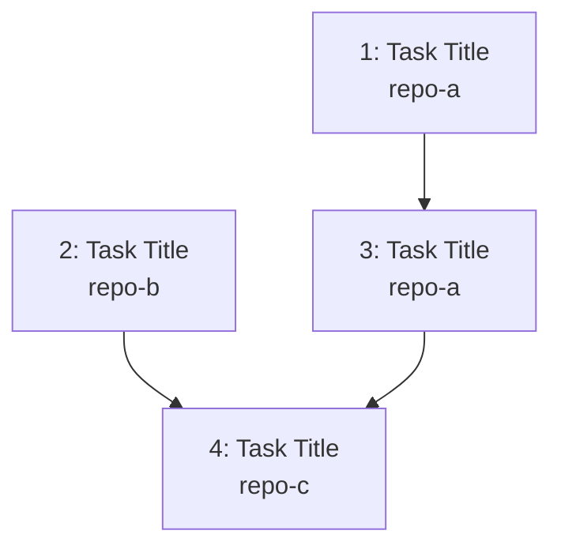

---
# ─────────────────────────────────────────────────────────────────────────────
# Task Graph Metadata (machine-parseable)
# ─────────────────────────────────────────────────────────────────────────────
epic_id: null           # Matches the epic's `id` field
epic_title: ""
total_tasks: 0
last_updated: null      # YYYY-MM-DD
critical_path: []       # Task IDs forming the longest dependency chain (e.g., [2, 3, 5])

tasks:
  - id: 1
    title: ""
    repo: ""                    # Which repo this task targets (must match repos.yaml key)
    target_branch: null         # Override repo's default main branch (null = use default from repos.yaml)
    request_file: "requests/1-name.md"
    jira_ticket: null           # e.g., PROJ-54368 — filled after ticket creation
    gh_issue: null              # GitHub issue number or URL, if created
    depends_on: []              # Task IDs this task depends on (can be cross-repo)
    blocks: []                  # Task IDs that depend on this task
    status: draft               # draft | refined | activated | planned | approved | in-progress | blocked | done | skipped
    complexity: null            # Fibonacci: 1 | 2 | 3 | 5 | 8 | 13
    assigned_to: null           # Optional: person or agent session

# ─────────────────────────────────────────────────────────────────────────────
# Negotiations & scope changes (post-approval)
# Added when scope is renegotiated after the epic was already confirmed.
# Use Prompt 11 (Amend Epic) to trigger and record these changes.
# ─────────────────────────────────────────────────────────────────────────────
negotiations: []
# Example:
#   - id: "neg-1"
#     date: 2026-05-20
#     trigger: "Design review revealed mobile viewport issues"
#     type: design          # product | design | engineering | policy
#     original_scope: "Single award tile component for all viewports"
#     revised_scope: "Separate mobile and desktop award tile variants"
#     rationale: "Mobile layout cannot accommodate the full tile anatomy"
#     tasks_added: [6]      # New task IDs created for this amendment
#     tasks_modified: [3]   # Existing tasks whose scope was updated
#     tasks_removed: []     # Tasks marked as skipped
#     impacted_tasks: [3, 4] # Tasks whose dependencies changed
#     repos_affected: ["marketplace-fe"]  # Which repos are impacted
#     decided_by: "Jane Smith"
---

# Task Graph: <EPIC_NAME>

> **Epic:** `../epic.md`
> **Total tasks:** _N_
> **Last updated:** _YYYY-MM-DD_

## Dependency Diagram

_Legend: Labels show task ID, title, and target repo. Independent tasks have no incoming edges. Arrows show "must complete before" relationships._

## Parallelization Notes

- Tasks ... and ... are independent — can be developed in parallel branches (even across repos).
- Task ... is the critical path bottleneck — it blocks ...
- Cross-repo dependency: Task ... (in `repo-a`) must complete before Task ... (in `repo-b`) can start.
- Recommended activation order: ...

## Jira Ticket Creation

_Jira tickets are created during task refinement (Prompt 7), NOT at breakdown time. This ensures each ticket is born with full requirements, acceptance criteria, and context._

### When to Create

- **Timing:** After each task is refined via Prompt 7 (status moves to `refined`).
- **Why not earlier?** At breakdown time, tasks are shells with minimal detail. Creating tickets then leads to barren tickets that need heavy updates later. The refinement session is where requirements become concrete and acceptance criteria become verifiable — that is the right moment to create the Jira record.
- **If Atlassian MCP is available:** The agent creates the ticket automatically during Prompt 7, following `config/jira-ticket-templates.md` for content structure.

### Content Standard

See `config/jira-ticket-templates.md` for the minimum ticket content standard. Every ticket must include at minimum: context (epic link, target repo, dependencies), goal statement, requirements list, acceptance criteria (3+ verifiable criteria), and dev notes (target repo, key files, patterns to follow).

### How to Create

1. During Prompt 7, after writing the refined request, the agent offers to create the Jira ticket.
2. The ticket is populated with full requirements, acceptance criteria, context, and dependency links.
3. The ticket ID is recorded in:
   - The request file's frontmatter (new `jira_ticket` field added)
   - The `task-graph.md` frontmatter for that task
4. Epic Link is set to the parent epic's Jira ticket.
5. "Blocks" / "Is Blocked By" relationships are set based on the dependency graph.

### Content Standard

See `config/jira-ticket-templates.md` for the full ticket content template. Every ticket must include at minimum:
- Context (epic link, target repo, dependencies including cross-repo, current state)
- Goal statement
- Requirements list
- Acceptance criteria (3+ verifiable criteria)
- Dev notes (target repo, key files, patterns to follow)

## Activation Checklist

1. Ensure the request has been refined (status: `refined` in request frontmatter)
2. Run `bin/dev dispatch <epic-id> <task-id>` to copy the request to the target repo
3. The command updates the task's status to `activated` automatically
4. Agent creates the branch in the target repo following conventions in `config/teams.yaml`
