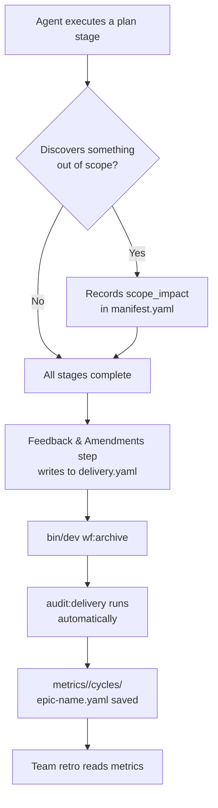

# Auditing & Metrics Guide

How delivery metrics are collected, when they're computed, and what you can learn from them.

---

## Overview

This hub tracks delivery quality through **amendments** (recorded during execution) and **metrics** (computed at epic close). Together they answer:

- Was our planning accurate? (focus ratio)
- What patterns cause scope expansion? (amendment types)
- Are we getting faster over time? (velocity trends)
- Where should we invest in improving our process? (derived insights)

---

## How Data Flows



Key point: **No manual metrics-writing step exists.** Agents record amendments during execution; the audit computes everything from the existing data when you archive the epic.

---

## What Gets Recorded (During Execution)

### Amendments in `delivery.yaml`

Every time plan execution reveals a new requirement that's out of scope, the agent records it:

```yaml
amendments:
  - date: 2026-06-10
    discovered_in_task: 2
    discovered_in_stage: 3
    type: missing_dependency       # see types below
    summary: "API lacks a /batch endpoint needed for the frontend grid"
    action: request_created
    request_file: "requests/5-add-batch-endpoint.md"
    jira_ticket: PROJ-123
```

**Amendment types:**

| Type | Meaning | Planning implication |
|------|---------|---------------------|
| `new_requirement` | A feature/behavior nobody anticipated | Epic breakdown missed a requirement |
| `missing_dependency` | Something that must exist but doesn't | Dependency analysis was incomplete |
| `scope_gap` | The request under-specified the work needed | Request refinement needs more depth |
| `infra_need` | Infrastructure work (env vars, secrets, config) | Should add an infra checklist to planning |

### Discovery log in `manifest.yaml`

During execution, the agent also records lighter-weight observations:

```yaml
discoveries:
  - severity: info
    message: "Module uses legacy pattern — works but worth modernizing later"
  - severity: scope_impact
    message: "Index mapping doesn't include the required field — new task needed"
```

The `scope_impact` items become formal amendments in the Feedback step after execution.

---

## When Metrics Are Computed

| Trigger | What happens | Output |
|---------|--------------|--------|
| `bin/dev wf:archive <epic>` | Automatically runs `audit:delivery --save` | `metrics/<team-name>/cycles/<epic-name>.yaml` |
| `bin/dev audit:delivery <epic-id>` | On-demand report (doesn't save unless `--save` flag) | Terminal output |
| `bin/dev audit:delivery <epic-id> --json` | Machine-readable output | JSON to stdout |
| `bin/dev audit:delivery <epic-id> --save` | Explicit save without archiving | Writes YAML file |

**Normal flow:** You never need to run the audit manually. It runs as part of archive. But you can run it mid-epic to check progress.

---

## What the Audit Report Shows

```
┌─────────────────────────────────────────────────────────────────┐
│  Delivery Audit: 1-my-first-epic
└─────────────────────────────────────────────────────────────────┘

📊 Task Progress
  Total tasks:     6
  Done:            5
  Skipped:         1
  Remaining:       0
  Completion:      100%

🎯 Scope & Focus
  Original tasks:  4
  Current tasks:   6
  Focus ratio:     0.67 (1.0 = no scope change)
  Amendments:      3
  Negotiations:    1

🚀 Delivery
  PR nodes:        5
  Merged:          5
  Abandoned:       0
  Incidents:       1

💡 Insights
  ✗ Significant scope expansion — planning may have missed requirements

  Amendment types found:
    2x missing_dependency
    1x infra_need

  ⚠ 1 incident(s) logged — review for process improvements
```

---

## Reading Saved Metrics

Saved metrics live at `metrics/<team-name>/cycles/<epic-name>.yaml`:

```yaml
epic: "1-my-first-epic"
generated: "2026-06-15T14:30:00Z"

tasks:
  total: 6
  done: 5
  skipped: 1

scope:
  original_tasks: 4
  final_tasks: 6
  focus_ratio: 0.67
  amendments: 3
  negotiations: 1

delivery:
  nodes_total: 5
  merged: 5
  abandoned: 0

quality:
  incidents: 1
```

### Key metrics to watch across epics

| Metric | Good | Warning | Action |
|--------|------|---------|--------|
| **Focus ratio** | ≥ 0.9 | < 0.7 | Improve requirement discovery in Prompt 5/6 |
| **Amendments** | 0-1 per epic | 3+ | Check which `type` recurs and address root cause |
| **Incidents** | 0 | 2+ | Review for process/tooling improvements |
| **Negotiations** | 0-1 | 3+ | Epic may have been started before requirements were clear |

---

## The Metrics Schema

`metrics/<team-name>/schema.yaml` defines what's tracked. It has three levels:

1. **Epic metrics** — computed per-epic at archive time (lead time, focus ratio, amendment count)
2. **Task metrics** — computed per-task from delivery.yaml nodes (cycle time, review time, commits)
3. **Derived insights** — computed across multiple epics (velocity trend, estimation accuracy, planning quality)

The schema is the contract — the audit command produces data conforming to it. As you accumulate cycles, higher-level insights become meaningful.

> **Setup:** Replace `<team-name>` with your team's name in `metrics/`, `config/teams.yaml`, and any schema references. The `bin/dev wf:archive` command creates the directory automatically on first use.

---

## Manual Steps You Might Take

| Situation | What to do |
|-----------|------------|
| **Mid-epic progress check** | `bin/dev audit:delivery <epic-id>` |
| **Save metrics without archiving** | `bin/dev audit:delivery <epic-id> --save` |
| **Compare two epics** | Read both YAML files in `metrics/<team-name>/cycles/` side by side |
| **Feed into a retro** | Run `--json` and paste into a retro doc / Confluence |
| **Epic took too long — why?** | Check focus ratio + amendment types for patterns |
| **Planning seems to always miss infra** | Filter amendments by `type: infra_need` across epics |
| **Agent keeps discovering stubs** | Check `type: missing_dependency` — indicates architecture docs need updating |

---

## Connection to Other Processes

| Process | How metrics connect |
|---------|---------------------|
| **Epic Planning (Prompt 5/6)** | Low focus ratios → planning needs more discovery depth |
| **Task Refinement (Prompt 7)** | Frequent `scope_gap` amendments → requests need more specificity |
| **Execution (Prompt 2)** | Agents record amendments in the Feedback step — this is where data originates |
| **Squad Retros** | `audit:delivery --json` provides hard numbers for discussion |
| **SQUAD_FLOW.md** | "Discovering Followup Work" section describes the human process; metrics measure its output |

---

## What Happens if You Skip the Audit

Nothing breaks. The archive still works (the audit runs but failures are non-blocking). You just lose:
- The saved metrics file for that epic
- The ability to compare that epic's delivery quality against others
- Input for process improvement conversations

You can always run it later: `bin/dev audit:delivery <epic-name> --save` works on any epic in `epics/` — including completed and abandoned ones.
