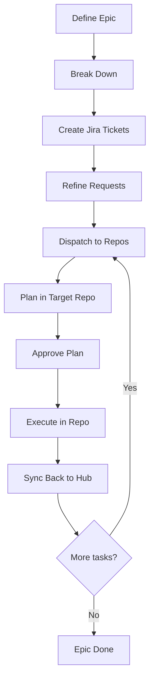
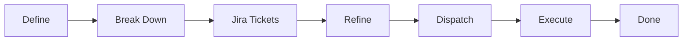
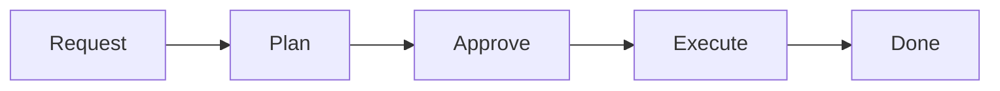

# Development Guide: Multirepo Hub Workflow

This document is the definitive human-facing reference for operating a Spec-Driven Development (SDD) multirepo coordination hub. It covers the full lifecycle from cross-repo epic planning through task dispatch, execution, and sync.

> **Context:** This hub is a **local planning and coordination tool** — it is never deployed. It manages cross-repo epics for a microservices architecture using git submodules, fallback SDD structures, and a dispatch protocol that routes work to individual repos.
>
> **Related documents:**
> - `AGENTS.md` — Rules for AI coding agents (modes of operation, commands, constraints)
> - `README.md` — Quick start, scaffolding, structure overview
> - `common-specs/sdd-process.md` — Universal SDD pipeline rules
> - `common-specs/git-workflow.md` — Git conventions across all repos
> - `common-specs/pr-conventions.md` — PR format and lifecycle

---

## Table of Contents

- [Philosophy](#philosophy)
- [Directory Layout](#directory-layout)
- [Two Modes of Operation](#two-modes-of-operation)
- [The Multirepo Pipeline](#the-multirepo-pipeline)
- [Spec Resolution Cascade](#spec-resolution-cascade)
- [The Fallback Pattern](#the-fallback-pattern)
- [The Sync Rule](#the-sync-rule)
- [Epic Planning (Cross-Repo)](#epic-planning-cross-repo)
- [Task Dispatch Protocol](#task-dispatch-protocol)
- [Per-Repo Execution](#per-repo-execution)
- [The Quick Fix Track](#the-quick-fix-track)
- [Git Workflow](#git-workflow)
- [Prompt Templates](#prompt-templates)
- [Commands Reference](#commands-reference)
- [Conventions](#conventions)
- [Quick Reference: Common Actions](#quick-reference-common-actions)

---

## Philosophy

This hub extends Spec-Driven Development to multi-repository architectures:

1. **Humans define *what* to build** — through epics that span repos and task requests that target specific repos.
2. **Agents figure out *how* to build it** — by reading the spec cascade and producing repo-scoped implementation plans.
3. **Humans approve before anything is built** — every plan goes through a review gate, regardless of which repo it targets.
4. **Agents execute approved plans in isolation** — working inside a single repo at a time, following its SDD pipeline.
5. **The hub is the single source of truth for coordination** — which tasks exist, what depends on what, which PRs are open where, and what merges in what order.

### Extended Principles for Multirepo

- **Repos are autonomous.** Each repo has (or will have) its own SDD pipeline. The hub does not bypass repo-level processes — it feeds work into them.
- **The hub never contains application code.** Code lives in repos. The hub contains only planning artifacts, specs, documentation, and coordination state.
- **Cross-repo dependencies are explicit.** The task-graph's `depends_on` field and delivery.yaml's merge order make cross-repo sequencing visible.
- **One developer per epic at a time.** But multiple epics can be active concurrently (each targeting different task subsets).
- **Source code is the source of truth.** If code contradicts a spec, code wins — update the spec.

### Approval is Field-Based

Approval is tracked via **status fields in YAML frontmatter**, not by moving files between folders. A plan with `approval.status: approved` in its `manifest.yaml` is ready for execution regardless of which directory it's in.

The only physical file move is **archiving** completed work to `done/` — this happens after execution.

---

## Directory Layout

```
hub/
├── config/
│   ├── repos.yaml                      ← Registry of all managed repos (source of truth)
│   └── teams.yaml                      ← Jira project, branching, team conventions
│
├── epics/                              ← Cross-repo epic planning
│   ├── _templates/
│   │   ├── epic.md                     ← Epic definition template
│   │   ├── task-graph.md               ← Task DAG template (with `repo` field per task)
│   │   └── delivery.yaml               ← PR tree template (with `repo` field per node)
│   ├── active/                         ← Epics currently being worked on
│   │   └── N-epic-name/
│   │       ├── epic.md
│   │       ├── task-graph.md
│   │       ├── delivery.yaml
│   │       └── requests/
│   └── done/                           ← Archived completed epics
│
├── repos/                              ← Git submodules (agent-managed ONLY)
│   ├── repo-a/                         ← Submodule → actual repo
│   └── repo-b/
│
├── fallback-sdd/                       ← SDD structures for repos without their own
│   └── <repo-name>/                    ← Mirrors what sdd/ would look like in the repo
│       ├── config/
│       │   └── commands.yaml           ← Repo-level bin/dev equivalent
│       ├── agent-development/
│       │   ├── agent-specs/            ← Context for agents working in this repo
│       │   ├── pending/                ← Dispatched requests land here
│       │   ├── plans/                  ← Plans produced here
│       │   └── done/                   ← Archive
│       └── user-development/
│
├── common-specs/                       ← Universal conventions (all repos)
│   ├── git-workflow.md
│   ├── pr-conventions.md
│   └── sdd-process.md
│
├── documentation/                      ← Per-repo architecture docs (hub-maintained)
│   └── <repo-name>/
│       └── overview.md
│
├── contracts/                          ← Cross-service interface specs
│   └── <repo-name>/
│       └── api-schema.yaml
│
├── architectural-schemas/              ← System-level topology diagrams
│   └── system-overview.md
│
├── user-development/                   ← Human-facing development assets
│   ├── DEVELOPMENT-GUIDE.md           ← You are here
│   ├── STATUS-REFERENCE.md            ← All status enums and transitions
│   ├── PR_TEMPLATE.md                 ← PR description template
│   └── prompts/                       ← Reusable prompt templates (0–8)
│
├── bin/dev                             ← Hub CLI (coordination commands only)
├── AGENTS.md                           ← Rules for AI coding agents
├── ADOPTION.md                         ← How to add repos to an existing hub
└── README.md                           ← Quick start and scaffolding guide
```

### What Lives Where

| Artifact | Location | Notes |
|----------|----------|-------|
| Repo registry | `config/repos.yaml` | All repos, tech stacks, deploy info, topology |
| Team config | `config/teams.yaml` | Jira project, branch naming, conventions |
| Epic planning | `epics/active/N-name/` | epic.md, task-graph.md, delivery.yaml, requests/ |
| Cross-repo docs | `documentation/<repo>/` | Fallback when repo lacks its own arch docs |
| Interface contracts | `contracts/<repo>/` | API schemas, event definitions |
| System topology | `architectural-schemas/` | How repos connect |
| Universal rules | `common-specs/` | Git workflow, PR conventions, SDD process |
| Repo-specific SDD (fallback) | `fallback-sdd/<repo>/` | Full SDD pipeline for repos without their own |
| Repo-specific SDD (native) | `repos/<repo>/sdd/` | Used when repo has adopted SDD internally |

---

## Two Modes of Operation

You (and your agents) operate in one of two modes at any given time:

### Coordination Mode (Hub Root)

**When:** Planning epics, dispatching tasks, updating status, reviewing cross-repo state.

**Working directory:** Hub root.

**What you do:**
- Define and refine epics (`epics/active/`)
- Break down epics into cross-repo task-graphs
- Dispatch tasks to target repos
- Update delivery.yaml as PRs are created/merged
- Review cross-repo status via `bin/dev status`

**Key rule:** You do NOT write application code in this mode.

### Execution Mode (Inside a Repo)

**When:** Implementing a specific task that has been dispatched to a repo.

**Working directory:** `repos/<name>/` (the submodule).

**What you do:**
- Read the repo's specs (via the cascade)
- Plan the task (produce plan folder)
- Execute the approved plan (write code, commit, PR)
- Update local plan status

**Key rule:** The agent works as if it's in a single-repo SDD setup. It uses the repo's own `sdd/` (or the hub's `fallback-sdd/<repo>/`) for all pipeline artifacts.

### Switching Modes

After completing execution in a repo, you **must** switch back to coordination mode to sync state (see [The Sync Rule](#the-sync-rule)).

---

## The Multirepo Pipeline

The full lifecycle of a cross-repo feature:



| Step | Mode | Who | Hub Prompt | Output |
|------|------|-----|------------|--------|
| **Define Epic** | Coordination | Human + Agent | Prompt 5 | `epic.md` |
| **Break Down** | Coordination | Agent | Prompt 6 | `task-graph.md` + `delivery.yaml` + request shells |
| **Create Tickets** | Coordination | Human / Agent (MCP) | — | Jira IDs in task-graph |
| **Refine Requests** | Coordination | Human + Agent | Prompt 7 | Full request documents |
| **Dispatch** | Coordination | Human / Agent | Prompt 8 / `bin/dev dispatch` | Request copied to target repo |
| **Plan** | Execution | Agent | Prompt 1 | Plan folder in target repo |
| **Approve** | — | Human | — | `approval.status: approved` |
| **Execute** | Execution | Agent | Prompt 2 | Code, commits, PR |
| **Sync Back** | Coordination | Agent | — | task-graph + delivery.yaml updated |
| **Epic Done** | Coordination | Human | `bin/dev wf:archive` | Epic moved to `done/` |

---

## Spec Resolution Cascade

When an agent needs context for a task, it resolves specs in priority order:

| Priority | Source | Path | Contains |
|----------|--------|------|----------|
| 1 | **Task plan** | Plan's `manifest.yaml` + stage files | Blast radius, specific instructions, verification |
| 2 | **Repo-level specs** | `repos/<repo>/sdd/agent-specs/` OR `fallback-sdd/<repo>/agent-specs/` | Architecture, coding standards, app overview |
| 3 | **Hub documentation** | `documentation/<repo>/` + `contracts/<repo>/` + `architectural-schemas/` | Cross-service context, API schemas, topology |
| 4 | **Common specs** | `common-specs/` | Git workflow, PR conventions, SDD process rules |

**Rule:** If a spec exists at the repo level (priority 2), it takes precedence over the hub's documentation (priority 3) or common specs (priority 4) for the same topic.

Use `bin/dev resolve-spec <type> <repo>` to programmatically find which spec file wins for a given repo.

---

## The Fallback Pattern

Not every repo has adopted SDD internally. The fallback pattern provides a seamless bridge:

```
Does repos/<name>/sdd/ exist?
├── YES → Use it (repo is self-sufficient)
└── NO  → Use fallback-sdd/<name>/ (hub provides the SDD structure)
```

### What Fallback Provides

When a repo doesn't have its own `sdd/`, the hub maintains an equivalent structure at `fallback-sdd/<repo>/`:

```
fallback-sdd/<repo>/
├── config/
│   └── commands.yaml           ← Build/test/lint commands for this repo
├── agent-development/
│   ├── agent-specs/            ← Architecture, coding standards for this repo
│   │   ├── application-overview.md
│   │   ├── architecture-breakdown.md
│   │   └── agent-instructions.md
│   ├── pending/                ← Dispatched task requests land here
│   ├── plans/                  ← Plans are created here
│   └── done/                   ← Completed work archived here
└── user-development/
    └── prompts/                ← (Optional) repo-specific prompt overrides
```

### Migration Path

When a repo is ready to own its own SDD:

```bash
bin/dev repo:migrate <name>
```

This moves `fallback-sdd/<name>/` into the repo as `repos/<name>/sdd/`, creates a commit in the repo, and updates `config/repos.yaml` (`has_own_sdd: true`).

---

## The Sync Rule

**After completing execution of a task, before ending your session, you must update both sides:**

### 1. Local Plan Status (in target repo)

- Plan's `manifest.yaml` → status: `done`
- Request → archived to `done/requests/`
- Plan folder → archived to `done/plans/`

### 2. Hub Coordination State (at hub root)

- `epics/active/<epic>/task-graph.md` → task status: `done`
- `epics/active/<epic>/delivery.yaml` → node status: `ready-for-review`, add `pr_url` and `branch`

### Why Both?

The local state is what the repo's SDD pipeline tracks. The hub state is what coordinates across repos. Without the sync, the hub doesn't know a task completed, and other tasks that depend on it won't be unblocked.

### When Sync Happens

- After successful plan execution (agent does this automatically)
- After PR merge (human updates delivery.yaml status → `merged`)
- After scope changes (update task-graph negotiations + delivery.yaml negotiation_impacts)

---

## Epic Planning (Cross-Repo)

### When to Use an Epic

- The feature spans **2+ repositories**
- OR involves **3+ tasks** with dependencies (even in one repo)
- OR needs coordinated deployment across services
- OR you want a **Jira-exportable** plan before creating tickets

For single-repo, single-task work, skip epics — dispatch a request directly.

### Epic Lifecycle



### The Task-Graph

The `task-graph.md` is the heart of cross-repo coordination. Each task has:

```yaml
tasks:
  - id: 1
    title: "Add v2 awards endpoint"
    repo: "awards-api"              # ← Which repo this executes in
    request_file: "requests/1-add-v2-endpoint.md"
    jira_ticket: "PROJ-123"
    depends_on: []                  # Task IDs (can be cross-repo!)
    status: draft
    complexity: 5
```

**Key:** The `repo` field links each task to a specific repo in `config/repos.yaml`. Cross-repo dependencies (task in repo-a depends on task in repo-b) are explicitly modeled.

### The Delivery Manifest

`delivery.yaml` maps tasks to PRs and tracks merge order:

```yaml
nodes:
  - id: "pr-1"
    task_id: 1
    repo: "awards-api"              # ← Which repo this PR lives in
    branch: "feat/PROJ-123-add-v2-endpoint"
    status: planned
    depends_on: []                  # Other PR node IDs
    deploy_notes: "Must deploy before pr-2 (frontend depends on this)"
```

**Branching strategy:**
- `independent` (default): Each task branches off its repo's main branch. Cross-repo deps wait for upstream to merge.
- `stacked` (same repo only): Dependent tasks branch off predecessors. Cross-repo always uses independent.

### Key Rules

1. **Product decisions live in the epic; implementation decisions live in requests.**
2. **All tasks carry a `repo` field** — no task is repo-ambiguous.
3. **Jira tickets are created after the task-graph is finalized** — before any dispatch.
4. **`delivery.yaml` is created at first dispatch** — it tracks all PRs across all repos.
5. **Negotiations are recorded** — scope changes update both `task-graph.md` and `delivery.yaml`.
6. **Merge order ≠ deployment order** — use `deploy_notes` for deployment sequencing.

---

## Task Dispatch Protocol

Dispatch moves a request from the hub's epic planning layer into a specific repo's SDD pipeline.

### How It Works

```bash
bin/dev dispatch <epic-id> <task-id>
```

This command:
1. Reads the task's `repo` field from `task-graph.md`
2. Resolves the target: `repos/<repo>/sdd/pending/` or `fallback-sdd/<repo>/agent-development/pending/`
3. Copies the request file from `epics/active/<epic>/requests/` to the target
4. Updates task status to `activated` in `task-graph.md`

### Manual Dispatch (if needed)

1. Copy `epics/active/<epic>/requests/<N>-name.md` → target repo's `pending/`
2. Update `task-graph.md`: set task status to `activated`
3. Ensure the request's frontmatter has `status: activated` and `target_repo: <name>`

### Pre-Dispatch Checklist

- [ ] Request has been refined (status: `refined`)
- [ ] Dependencies are satisfied (upstream tasks are `done` or `in-progress`)
- [ ] Jira ticket exists (ID recorded in task-graph)
- [ ] Target repo submodule is synced (`bin/dev repo:sync <name>`)

### Dispatch to Repos Without SDD

For repos using fallback, dispatch targets `fallback-sdd/<repo>/agent-development/pending/`. The request lives at the hub level but the agent treats it exactly as if it were `sdd/pending/` inside the repo.

---

## Per-Repo Execution

Once a task is dispatched, execution follows the standard SDD pipeline **inside the target repo**. The agent works as if it's in a single-repo setup.

### The Pipeline (Per-Repo)



| Stage | Who | What Happens |
|-------|-----|--------------|
| **Request** | (Already dispatched) | Request sits in repo's `pending/` with `status: activated` |
| **Plan** | Agent (Prompt 1) | Reads repo specs, produces plan folder in repo's `plans/` |
| **Approve** | Human | Reviews spec, resolves open questions, sets `approval.status: approved` |
| **Execute** | Agent (Prompt 2) | Creates branch, opens draft PR, commits stages, marks ready for review |
| **Done** | Agent | Archives plan + request, syncs back to hub |

### Where Artifacts Live

For a repo **with its own SDD** (`repos/<name>/sdd/`):
- Requests: `repos/<name>/sdd/agent-development/pending/`
- Plans: `repos/<name>/sdd/agent-development/plans/`
- Done: `repos/<name>/sdd/agent-development/done/`

For a repo **using fallback** (`fallback-sdd/<name>/`):
- Requests: `fallback-sdd/<name>/agent-development/pending/`
- Plans: `fallback-sdd/<name>/agent-development/plans/`
- Done: `fallback-sdd/<name>/agent-development/done/`

### Build/Test/Lint Commands

During execution, the agent needs to run repo-specific commands:
- If repo has its own SDD: `repos/<name>/sdd/bin/dev` (or its `config/commands.yaml`)
- If using fallback: `fallback-sdd/<name>/config/commands.yaml` defines the commands

---

## The Quick Fix Track

Small, unambiguous changes still skip the full pipeline. In multirepo context, you must additionally specify **which repo** the fix targets.

### Qualification Criteria

All of these must be true:
- Touches **1–3 files** (not counting spec/doc updates)
- Involves **no design decisions or ambiguity**
- Requires **no new dependencies**
- Does **not change public APIs, database schemas, or architectural patterns**
- Can be **fully described in a sentence or two**
- Is **not part of an active epic** (epic tasks always use the full pipeline)
- Targets a **single repo** (cross-repo changes are never quick fixes)

### How It Works

1. Open a new agent conversation.
2. Paste `user-development/prompts/4-quick-fix.md`.
3. Specify the **target repo** and the change description.
4. The agent works inside `repos/<name>/`, makes the change, runs verification.
5. Log file created in the target repo's `done/quick-fixes/` (or `fallback-sdd/<name>/agent-development/done/quick-fixes/`).

### Escape Hatch

If the change is larger than expected or crosses repos, the agent stops and recommends creating a full task request (with dispatch).

---

## Git Workflow

The hub has **two levels of git**: hub-level commits and repo-level commits.

### Hub-Level Commits

The hub repo tracks coordination artifacts. Commits here are about planning, not code.

**When to commit at the hub level:**
- Epic created/updated (`epic.md`, `task-graph.md`, `delivery.yaml`)
- Task dispatched (status updated in task-graph)
- Sync after execution (delivery.yaml updated)
- Fallback SDD changes (`fallback-sdd/` content)
- Config changes (`repos.yaml`, `teams.yaml`)
- Spec/documentation updates

**Commit format:**
```
<type>(<scope>): <description>

Types: epic, task, dispatch, sync, docs, config, chore
Scopes: epic-id, repo-name, or omitted
```

Examples:
```
epic(3-user-awards): define epic and task-graph
dispatch(3-user-awards): activate task 1 → awards-api
sync(3-user-awards): task 1 complete, PR #45 ready for review
config: add marketplace-fe to repos.yaml
```

### Repo-Level Commits

Inside `repos/<name>/`, commits follow that repo's conventions. These are independent git histories (submodules).

**Standard format** (from `common-specs/git-workflow.md`):
```
<type>(<scope>): <ticket-id> <description>

Co-authored-by: Copilot <223556219+Copilot@users.noreply.github.com>
```

### Branch Naming (Repos)

Branches in target repos follow `config/teams.yaml` conventions:
```
<type>/<ticket-id>-<short-description>
```

Example: `feat/PROJ-123-add-v2-awards-endpoint`

### Submodule Sync

Submodules point to specific commits. After repo work is done:
```bash
bin/dev repo:sync <name>    # Update submodule pointer to latest main
```

**Never run raw `git submodule` commands.** Always use `bin/dev repo:*`.

### PR Lifecycle (Repos)

PRs in target repos follow the standard progressive lifecycle:
1. Agent creates branch after plan approval
2. Agent opens **draft PR** (first commit = plan reference or initial implementation)
3. Agent pushes commits as stages complete
4. Agent marks PR **ready for review** after all stages pass
5. **Humans merge** — agents never merge PRs

Full details in `common-specs/pr-conventions.md`.

---

## Prompt Templates

| # | File | Type | Mode | Purpose |
|---|------|------|------|---------|
| 0 | `0-bootstrap-hub.md` | One-shot | Coordination | Bootstrap hub context (specs, docs, fallback-sdd) for registered repos |
| 1 | `1-plan-task.md` | One-shot | Execution | Generate a plan from an activated request (in target repo) |
| 2 | `2-execute-plan.md` | One-shot | Execution | Execute an approved plan (in target repo) |
| 3 | `3-create-request.md` | Interactive | Either | Technical discovery → write a standalone request |
| 4 | `4-quick-fix.md` | One-shot | Execution | Small change in a specific repo |
| 5 | `5-create-epic.md` | Interactive | Coordination | Product discovery → produce `epic.md` |
| 6 | `6-break-down-epic.md` | One-shot | Coordination | Decompose epic → task-graph + delivery.yaml + request shells |
| 7 | `7-refine-epic-request.md` | Interactive | Coordination | Refine a shell request into a full document |
| 8 | `8-dispatch-tasks.md` | One-shot | Coordination | Dispatch refined requests to target repos |

**Interactive prompts** (3, 5, 7): The agent does NOT write files until the human declares refinement complete.

### When to Use What

| Goal | Prompt Sequence |
|------|-----------------|
| Plan a new cross-repo feature | 5 → 6 → (Jira) → 7 per task → 8 → 1 per task → approve → 2 per task |
| Add a quick single-repo feature (no epic) | 3 → dispatch manually → 1 → approve → 2 |
| Make a trivial fix in one repo | 4 |
| Bootstrap a new hub | 0 |

---

## Commands Reference

Hub-level commands are accessed via `bin/dev` at the hub root. These handle coordination — not building or testing (those happen inside repos).

### Repository Management

| Command | Purpose |
|---------|---------|
| `bin/dev repo:list` | Show all repos with sync status and SDD adoption |
| `bin/dev repo:sync [name]` | Update submodule(s) to latest main |
| `bin/dev repo:add <name> <url>` | Register new repo (adds to `repos.yaml` + creates submodule) |
| `bin/dev repo:enter <name>` | Print context for a repo (paths, SDD location, commands) |
| `bin/dev repo:migrate <name>` | Move `fallback-sdd/<name>/` into the repo as `sdd/` |

### Workflow & Status

| Command | Purpose |
|---------|---------|
| `bin/dev status [epic-id]` | Cross-repo status dashboard (all epics or a specific one) |
| `bin/dev wf:next` | Show next actionable task (respects dependencies) |
| `bin/dev wf:validate` | Validate YAML manifests (task-graph, delivery, repos.yaml) |

### Dispatch & Planning

| Command | Purpose |
|---------|---------|
| `bin/dev dispatch <epic-id> <task-id>` | Copy request to target repo, update status to `activated` |
| `bin/dev resolve-spec <type> <repo>` | Find which spec file wins for a given repo (via cascade) |

### Feedback

| Command | Purpose |
|---------|---------|
| `bin/dev note "msg"` | Record a finding for human review |
| `bin/dev help` | Show all available commands |

### Repo-Level Commands (Inside repos/)

When executing inside a repo, use that repo's own tooling:
- If repo has SDD: `repos/<name>/sdd/bin/dev` (build, test, lint, verify, etc.)
- If using fallback: check `fallback-sdd/<name>/config/commands.yaml` for available commands

---

## Conventions

### Complexity Scale (Fibonacci)

| Value | Meaning | Guidance |
|---|---|---|
| 1 | Trivial | Rename, config change, single-file tweak |
| 2 | Small | 1–2 files, no design decisions |
| 3 | Medium | 3–5 files, one clear approach |
| 5 | Large | 5–10 files, some design decisions |
| 8 | Very Large | Consider splitting |
| 13 | Epic-sized | Must be split into multiple tasks |

### File Naming

- **Epic folders:** `N-short-kebab-name/` (e.g., `3-user-awards/`)
- **Requests:** `N-short-kebab-name.md` (e.g., `1-add-v2-endpoint.md`)
- **Plan folders:** `N-short-kebab-name/` (e.g., `1-add-v2-endpoint/`)
- **Stage files:** `N-stage-name.md` inside plan folder
- **Quick fix logs:** `YYYYMMDD-short-description.md`
- **Templates:** `_templates/` or `_TEMPLATE-*` (underscore prefix sorts first)

### Status Tracking

See `user-development/STATUS-REFERENCE.md` for all valid status values and transitions.

Key statuses:
```
Request:  draft → refined → activated → planned → done
Plan:     draft → pending-approval → approved → in-progress → done
Task:     draft → refined → activated → planned → approved → in-progress → done | skipped
Epic:     discussing → decomposed → activated → in-progress → done
PR Node:  planned → branched → draft-pr → in-progress → ready-for-review → merged | abandoned
```

### Configuration Files

| File | Purpose | Edit Manually? |
|------|---------|----------------|
| `config/repos.yaml` | Repo registry, topology | Via `bin/dev repo:add` or carefully by hand |
| `config/teams.yaml` | Jira, branching, conventions | Yes |
| `fallback-sdd/<repo>/config/commands.yaml` | Repo build/test commands | Yes |

### Open Questions Mechanism

Agents surface ambiguity as `PENDING` markers in `specification.md`:
- Planning agent writes options + recommendation
- Human resolves by replacing `PENDING` with a decision
- Executing agent refuses to proceed if any `PENDING` markers remain

---

## Quick Reference: Common Actions

### "I want to plan a cross-repo feature"

1. **Prompt 5** → interactive discovery → produces `epic.md` (status: `decomposed`)
2. **Prompt 6** → agent produces `task-graph.md` (with `repo` per task) + `delivery.yaml` + request shells
3. **Create Jira tickets** (manual or via MCP) → record IDs in `task-graph.md`
4. **Prompt 7** per task → interactive refinement → full request (status: `refined`)
5. **Prompt 8** (or `bin/dev dispatch`) → requests copied to target repos (status: `activated`)
6. Per task: **Prompt 1** → plan (in target repo's `plans/`)
7. **Approve** → set `approval.status: approved` in plan's `manifest.yaml`
8. Per task: **Prompt 2** → agent executes, creates branch + PR in target repo
9. Agent **syncs** task-graph + delivery.yaml after each task completes
10. After all PRs merged: `bin/dev wf:archive <epic-id>`

### "I want to dispatch the next task"

1. Run `bin/dev wf:next` to see what's actionable.
2. Ensure the request is refined (status: `refined`).
3. Run `bin/dev dispatch <epic-id> <task-id>`.
4. Open a new agent conversation, paste Prompt 1, reference the dispatched request.

### "I want to execute an approved plan"

1. Identify which repo the plan is in (`bin/dev repo:enter <name>` for context).
2. Open a new agent conversation.
3. Paste `user-development/prompts/2-execute-plan.md`.
4. Reference the plan folder location (in repo's `sdd/plans/` or `fallback-sdd/<repo>/plans/`).
5. Agent verifies approval, creates branch, executes stages, opens PR.
6. Agent syncs status back to hub's task-graph + delivery.yaml.

### "I want to add a quick single-repo feature (no epic)"

1. **Prompt 3** → discovery + request → request in target repo's `pending/`
2. **Prompt 1** → plan produced
3. **Approve** → update approval fields
4. **Prompt 2** → agent executes

### "I want to make a trivial fix in one repo"

1. Paste `user-development/prompts/4-quick-fix.md`.
2. Specify the target repo and describe the change.
3. Agent implements, verifies, logs.

### "I want to see cross-repo status"

```bash
bin/dev status              # All active epics
bin/dev status 3            # Specific epic
bin/dev wf:next             # Next actionable task
bin/dev repo:list           # Repo sync state
```

### "I want to add a new repo to this hub"

```bash
bin/dev repo:add my-new-service git@github.com:org/my-new-service.git
```

Then use **Prompt 0** to bootstrap its documentation and fallback-sdd.

### "I want a repo to own its own SDD"

```bash
bin/dev repo:migrate <name>
```

This copies `fallback-sdd/<name>/` into the repo as `sdd/`, updates `repos.yaml`, and commits in both repos.
