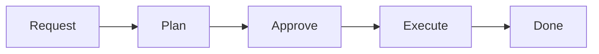

# Development Guide: Spec-Driven Agent Workflow

This document describes the development workflow used in this project. It follows a **Spec-Driven Development (SDD)** model where AI agents plan and implement tasks under human supervision. Every meaningful decision goes through a human approval gate.

> **Note:** This guide is part of the [SDD Boilerplate](../README.md). It is designed to be adopted as-is into new projects. You should not need to modify this file unless you want to change the workflow itself — project-specific details live in `agent-development/agent-specs/`.

---

## Table of Contents

- [Philosophy](#philosophy)
- [Directory Layout](#directory-layout)
- [The Pipeline](#the-pipeline)
- [The Quick Fix Track](#the-quick-fix-track)
- [Plan Structure](#plan-structure)
- [File Lifecycle](#file-lifecycle)
- [The Open Questions Mechanism](#the-open-questions-mechanism)
- [Git Workflow & Commits](#git-workflow--commits)
- [Prompt Templates](#prompt-templates)
- [Document Templates](#document-templates)
- [Project Specs](#project-specs)
- [Conventions](#conventions)
- [Quick Reference: Common Actions](#quick-reference-common-actions)

---

## Philosophy

This project follows a **spec-driven development** model:

1. **Humans define *what* to build** — through task requests and by resolving open questions.
2. **Agents figure out *how* to build it** — through detailed implementation plans broken into stages.
3. **Humans approve before anything is built** — every plan goes through a review gate.
4. **Agents execute approved plans** — following the stages and steps that were already vetted.

The key principle is that **no code is written without an approved plan**, and **no plan is approved without human review**. This creates a clear audit trail and prevents agents from making unsupervised architectural decisions.

### Approval is Field-Based

Approval is tracked via **status fields in YAML frontmatter**, NOT by moving files between folders. A plan with `approval.status: approved` in its `manifest.yaml` is ready for execution regardless of which directory it's in.

The only physical file move in the workflow is **archiving** completed work to `done/` — this happens after execution, not as an approval signal.

See `user-development/STATUS-REFERENCE.md` for all status enums and valid transitions.

---

## Directory Layout

```
user-development/                   ← Human-facing development assets
├── DEVELOPMENT-GUIDE.md            ← You are here
├── STATUS-REFERENCE.md             ← All status enums and transitions
└── prompts/                        ← Reusable prompt templates for humans
    ├── 0-bootstrap-specs.md        ← "Bootstrap agent-specs/ for a new project"
    ├── 1-plan-task.md
    ├── 2-execute-plan.md
    ├── 3-create-request.md
    └── 4-quick-fix.md

agent-development/                  ← Agent pipeline (requests, plans, execution)
├── agent-specs/                    ← Project-level specifications (read-only context)
│   ├── agent-instructions.md       ← Coding standards, dos/don'ts, naming, testing
│   ├── agent-workflow.md           ← Execution rules, blast radius, commit timing
│   ├── application-overview.md     ← What the app does
│   ├── architecture-breakdown.md   ← Folder structure, patterns, tech stack
│   └── git-workflow.md             ← Branching, commit conventions, versioning
├── pending/                        ← Task requests waiting to be planned
│   └── _TEMPLATE-request.md        ← Template for new requests
├── plans/                          ← All plans (status tracked in manifest.yaml)
│   └── _templates/                 ← Templates for creating new plan folders
│       ├── manifest.yaml
│       ├── specification.md
│       └── stage.md
└── done/                           ← Completed work (archive)
    ├── plans/                      ← Executed plan folders
    ├── requests/                   ← Fulfilled requests
    └── quick-fixes/                ← Quick fix log files
```

---

## The Pipeline

Every piece of work flows through these stages. Status is tracked in YAML frontmatter — no folder moves required for approval.



### Stage 1: Request

**Who:** Human (optionally assisted by an agent using Prompt 3).

**What happens:**
- A task request file is created in `agent-development/pending/` following `_TEMPLATE-request.md`.
- The file has YAML frontmatter with `status: draft` (or `activated` if fully specified).
- The request defines *what* needs to be done — goal, context, requirements, complexity — but NOT *how*.

**Output:** A new file in `agent-development/pending/` with frontmatter `status: activated`.

### Stage 2: Plan

**Who:** An AI agent, guided by Prompt 1.

**What happens:**
- The agent reads all `agent-development/agent-specs/` documents for context.
- The agent reads the specific task request from `pending/`.
- The agent reads relevant source code to understand the current state.
- The agent produces a **plan folder** in `agent-development/plans/` containing:
  - `manifest.yaml` (with `status: pending-approval`, `approval.status: pending`)
  - `specification.md` (plan overview and open questions)
  - One or more numbered stage files

**Output:** A plan folder in `agent-development/plans/` ready for review.

### Stage 3: Approve

**Who:** Human (you).

**What happens:**
- You read the `specification.md` in the plan folder.
- You review the **"Open Questions & Decisions"** section and resolve all `PENDING` markers.
- You can modify any part of the plan if you disagree.
- Once satisfied, you **update the approval fields**:
  - In `manifest.yaml`: set `plan_metadata.approval.status: approved`, fill `approved_by` and `approved_at`
  - Set `plan_metadata.status: approved`

**The field update is the approval signal.** No folder move is needed.

**Output:** Plan manifest shows `approval.status: approved`.

### Stage 4: Execute

**Who:** An AI agent, guided by Prompt 2.

**What happens:**
- The agent reads `manifest.yaml` and verifies `approval.status == approved`.
- The agent verifies no `PENDING` markers remain in `specification.md`.
- The agent creates the branch (following `git-workflow.md` conventions).
- The agent executes stages in order, committing after each stage.
- After each stage, the agent updates `manifest.yaml` (stage status, current_stage).
- After all stages pass, the agent archives:
  - Plan folder → `agent-development/done/plans/`
  - Request → `agent-development/done/requests/`

**Output:** Code written, plan and request archived.

### Stage 5: Done

**Who:** Automatic (performed by the executing agent).

**What happens:**
- Plan folder and request are archived to `done/` subdirectories.
- They serve as a historical record of what was built and why.

---

## The Quick Fix Track

Not every change warrants the full pipeline. The **quick fix track** is for small, unambiguous changes.

### When to Use It

A change qualifies as a quick fix if **all** of the following are true:

- It touches **1–3 files** (not counting spec/doc updates)
- It involves **no design decisions or ambiguity**
- It requires **no new dependencies**
- It does **not change public APIs, database schemas, or architectural patterns**
- It can be **fully described in a sentence or two**

If any of these criteria aren't met, use the full pipeline instead.

### How It Works

1. Open a new agent conversation.
2. Paste the contents of `user-development/prompts/4-quick-fix.md`.
3. Replace `<CHANGE_DESCRIPTION>` with a plain-language description.
4. The agent makes the change, runs verification, and produces a summary.
5. The agent creates a log file in `agent-development/done/quick-fixes/`.

There is **no plan folder, no approval gate, and no request file**. The audit trail is the log file.

### Escape Hatch

If the agent discovers mid-change that the work is larger or more ambiguous than expected, it **must stop** and recommend creating a full task request instead.

### Log Files

Each quick fix produces a Markdown file in `agent-development/done/quick-fixes/`:

```
YYYYMMDD-short-description.md
```

---

## Plan Structure

Plans are **folders**, not single files. This structure allows large tasks to be broken into independently verifiable stages.

### Plan Folder Layout

```
N-short-name/
├── manifest.yaml                    ← Authoritative record (YAML, machine-parseable)
├── specification.md                 ← Human-readable overview (frontmatter + prose)
├── 1-first-stage-name.md            ← Stage 1 instructions
├── 2-second-stage-name.md           ← Stage 2 instructions
├── ...
├── N-1-spec-updates.md              ← Penultimate stage (multi-stage only)
└── N-documentation-updates.md       ← Final stage (multi-stage only)
```

### manifest.yaml

The **single authoritative record** of task state. Key sections:

- **`plan_metadata`** — task ID, name, status, complexity (Fibonacci), approval tracking, timestamps.
- **`dependencies`** — required prior tasks, packages, affected modules.
- **`stages`** — ordered array with status, complexity, blast radius, verification commands, and rollback plan per stage.

The approval field in `manifest.yaml` is the canonical approval signal:
```yaml
approval:
  status: approved        # This makes the plan executable
  approved_by: "Name"
  approved_at: "2025-01-15"
```

### specification.md

The **human-readable plan overview** with YAML frontmatter for quick-reference metadata (approval is tracked only in `manifest.yaml`). Contains: Overview, Reference Documents, Pre-Conditions, Stages summary, Open Questions, File Manifest, Post-Completion Checklist, and Notes.

### Stage Files

Each stage file is a self-contained instruction set (Markdown). Contains: Objective, Blast Radius (read/write), Prerequisites, Instructions, Verification, Commit guidance, and Rollback Plan.

Stage files remain **pure Markdown** — they don't need YAML frontmatter because their state is tracked in `manifest.yaml`.

### Spec & Doc Updates

Every plan ensures `agent-development/agent-specs/` and human-facing docs stay current:

- **Multi-stage plans:** Separate penultimate (specs) and final (docs) stages.
- **Single-stage plans:** Inline steps at the end of the single stage.

---

## File Lifecycle

With field-based approval, files don't move until archiving:

```
Request created → stays in pending/ throughout its lifecycle
                → archived to done/requests/ after execution

Plan created    → stays in plans/ throughout its lifecycle
                → archived to done/plans/ after execution
```

Status transitions (tracked in YAML frontmatter):
```
Request:  draft → refined → activated → planned → done
Plan:     draft → pending-approval → approved → in-progress → done
```

---

## The Open Questions Mechanism

### Why It Exists

AI agents are good at following specifications but bad at making subjective decisions. When a planning agent encounters ambiguity, it writes up the question in `specification.md` under **"Open Questions & Decisions"**.

### How It Works

1. **Planning agent** writes each question with options, trade-offs, and a recommendation.
2. **Human reviewer** replaces `PENDING` with their decision.
3. **Executing agent** verifies no `PENDING` markers remain. If any do, it refuses to execute.

### Example

Before approval:
```
**Human decision:** `PENDING`
```

After approval:
```
**Human decision:** B — agreed, let's keep JSON. Also pretty-print with 2-space indent.
```

---

## Git Workflow & Commits

Full details live in `agent-development/agent-specs/git-workflow.md`. This section is a human-facing summary.

### Branching

The human creates the branch before starting an agent conversation. Agents work on whatever branch is currently checked out — they will verify they're not on `main` and refuse to proceed if they are.

**Branch naming format:**
```
<type>/<ticket-id>-<short-description>
```

Examples: `feat/PROJ-123-add-user-preferences`, `fix/correct-pagination-offset`, `chore/update-dependencies`.

The ticket ID is optional. If present in the branch name, agents automatically include it in every commit message.

### Commit Conventions

[Conventional Commits](https://www.conventionalcommits.org/) (v1.0.0):

```
<type>(<optional-scope>): <ticket-id> <description>
```

### Commit Timing

**During plan execution:** One commit per stage, made after the stage's verification checks pass and `manifest.yaml` has been updated. Each commit in the branch represents a verified, self-contained unit of work. After all stages are complete, the archive file moves get a separate `chore` commit.

**During quick fixes:** One commit for the entire fix.

### Pull Requests

PRs follow a standard lifecycle:

1. Human creates the branch.
2. Agent executes the plan, committing per-stage.
3. Human creates the PR (or agent opens a draft if supported).
4. Humans review and merge the PR. Agents never merge PRs.

**Force push is not allowed** unless a human developer explicitly requires git history rewriting.

### Versioning

Agents do **not** bump version numbers. The commit types signal expected impact:

| Change Type | Version Impact | Signal |
|---|---|---|
| Bug fixes | PATCH (0.0.x) | `fix` commits |
| New features | MINOR (0.x.0) | `feat` commits |
| Breaking changes | MAJOR (x.0.0) | `feat!` or `BREAKING CHANGE` |

---

## Prompt Templates

| # | File | Type | Purpose |
|---|---|---|---|
| 0 | `0-bootstrap-specs.md` | One-shot | Bootstrap `agent-specs/` for a new project |
| 1 | `1-plan-task.md` | One-shot | Generate a plan from an activated request |
| 2 | `2-execute-plan.md` | One-shot | Execute an approved plan |
| 3 | `3-create-request.md` | Interactive | Technical discovery + write request |
| 4 | `4-quick-fix.md` | One-shot | Small change that skips the full pipeline |

**Interactive prompts** (3) have a critical rule: the agent does NOT write any files until the human explicitly declares refinement complete.

---

## Document Templates

| Template | Location | Format |
|---|---|---|
| Request | `agent-development/pending/_TEMPLATE-request.md` | Frontmatter + Markdown |
| Plan manifest | `agent-development/plans/_templates/manifest.yaml` | Pure YAML |
| Plan specification | `agent-development/plans/_templates/specification.md` | Frontmatter + Markdown |
| Stage instructions | `agent-development/plans/_templates/stage.md` | Pure Markdown |

---

## Project Specs

The `agent-development/agent-specs/` directory provides global context to every agent:

| Document | Purpose | Update Frequency |
|---|---|---|
| `agent-instructions.md` | Coding standards, dos/don'ts, naming, testing | Frequently |
| `agent-workflow.md` | Execution rules, blast radius, commit timing | Rarely |
| `application-overview.md` | What the app does, core workflows | Occasionally |
| `architecture-breakdown.md` | Directory tree, patterns, tech stack | Per-task |
| `git-workflow.md` | Branching, commits, versioning | Once at setup |

---

## Conventions

### File Naming

- **Requests:** `N-short-kebab-name.md` (e.g., `3-centralize-data.md`)
- **Plan folders:** `N-short-kebab-name/` (e.g., `3-centralize-data/`)
- **Stage files:** `N-stage-name.md` inside plan folder (e.g., `1-data-layer.md`)
- **Quick fix logs:** `YYYYMMDD-short-description.md`
- **Templates:** `_templates/` or `_TEMPLATE-*` (underscore prefix sorts first)

### Complexity Scale (Fibonacci)

All tasks and stages use Fibonacci numbers for complexity estimation:

| Value | Meaning | Guidance |
|---|---|---|
| 1 | Trivial | Rename, config change, single-file tweak |
| 2 | Small | 1-2 files, no design decisions |
| 3 | Medium | 3-5 files, one clear approach |
| 5 | Large | 5-10 files, some design decisions |
| 8 | Very Large | Consider splitting |
| 13 | Epic-sized | Must be split into multiple tasks |

### Status Tracking

See `user-development/STATUS-REFERENCE.md` for all valid status values and transitions.

### Configuration Files

| Git-tracked template | Runtime copy (gitignored) | Purpose |
|---|---|---|
| `.env.example` | `.env` | Environment variables |

### Spec Updates

If a task introduces new modules or changes architecture, the executing agent updates `agent-specs/architecture-breakdown.md` and/or `agent-instructions.md`. This happens in a separate penultimate stage (multi-stage) or inline (single-stage).

### Documentation Updates

If a task changes user-facing behavior, the executing agent updates `README.md` and relevant docs. This happens in a separate final stage (multi-stage) or inline (single-stage).

---

## Quick Reference: Common Actions

### "I want to add a new feature"

1. Open a new agent conversation.
2. Paste `user-development/prompts/3-create-request.md`.
3. Describe what you want. Answer discovery questions.
4. Tell the agent to write it → creates a request in `pending/`.

### "I want to plan the next task"

1. Open a new agent conversation.
2. Paste `user-development/prompts/1-plan-task.md`.
3. Reference the request in `pending/`.
4. Agent creates plan folder in `plans/` with `approval.status: pending`.
5. **Review `specification.md` and resolve all open questions.**
6. Update `manifest.yaml`: set `approval.status: approved`.

### "I want to execute an approved plan"

1. Open a new agent conversation.
2. Paste `user-development/prompts/2-execute-plan.md`.
3. Reference the plan folder in `plans/`.
4. Agent verifies approval, creates branch, executes stages.

### "I want to make a small, obvious change"

1. Open a new agent conversation.
2. Paste `user-development/prompts/4-quick-fix.md`.
3. Describe the change.
4. Agent implements, verifies, creates log file.

### "I want to see what's in progress"

- **What needs planning?** → `agent-development/pending/` (check frontmatter status: `activated`)
- **What's planned but not approved?** → `agent-development/plans/` (check `manifest.yaml` for `approval.status: pending`)
- **What's approved and ready?** → `agent-development/plans/` (check `manifest.yaml` for `approval.status: approved`)
- **What's done?** → `agent-development/done/`
