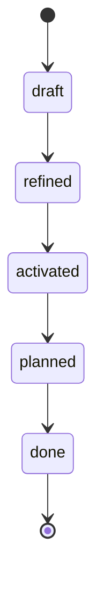
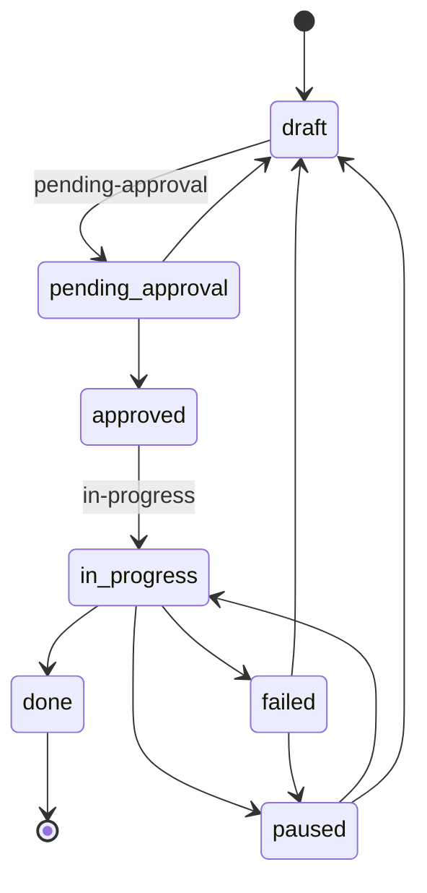
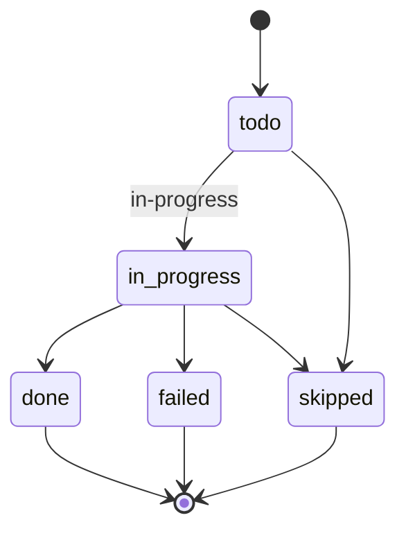

# Status Reference — SDD Workflow System

> **Canonical reference for all status enums, complexity scales, and state transitions used in the workflow.**

This document defines every valid status value across all workflow layers. Use it to understand where an artifact is in its lifecycle, who can transition it, and what transitions are legal.

---

## How to Read This Document

Each layer section includes:

- **Status table** — every value, its meaning, who transitions it, and what comes next
- **Transition diagram** — a Mermaid state chart showing valid moves between statuses

Statuses are always lowercase, hyphenated strings stored in YAML frontmatter or manifest files. They are never inferred from file location (see [Approval is Field-Based](#approval-is-field-based) below).

---

## Request Statuses

Requests are the initial ask from a human that spawns a planning + execution cycle. Status is tracked in the request file's YAML frontmatter.

| Status | Meaning | Transitioned by | Next statuses |
|--------|---------|-----------------|---------------|
| `draft` | Initial capture; may be incomplete | Human | `refined` |
| `refined` | Fully specified and ready for action | Human / Agent | `activated` |
| `activated` | Accepted and ready for planning | Human | `planned` |
| `planned` | Execution plan exists | Agent | `done` |
| `done` | Request has been fulfilled | Agent / Human | _(terminal)_ |

---

## Plan Statuses

Plans (stored in `manifest.yaml`) describe how a task will be executed. They go through an approval cycle before work begins.

| Status | Meaning | Transitioned by | Next statuses |
|--------|---------|-----------------|---------------|
| `draft` | Plan is being authored | Agent | `pending-approval` |
| `pending-approval` | Submitted for human review | Agent | `approved`, `draft` |
| `approved` | Human has signed off on the approach | Human | `in-progress` |
| `in-progress` | Execution has started | Agent | `done`, `failed`, `paused` |
| `done` | All stages completed successfully | Agent | _(terminal)_ |
| `failed` | Execution failed; requires intervention | Agent | `draft`, `paused` |
| `paused` | Execution halted mid-flight | Human / Agent | `in-progress`, `draft` |

---

## Stage Statuses

Stages are ordered steps within a plan (`manifest.yaml → stages[]`). They execute sequentially.

| Status | Meaning | Transitioned by | Next statuses |
|--------|---------|-----------------|---------------|
| `todo` | Not yet started | _(initial)_ | `in-progress`, `skipped` |
| `in-progress` | Currently being executed | Agent | `done`, `failed`, `skipped` |
| `done` | Completed successfully | Agent | _(terminal)_ |
| `skipped` | Will not be executed (e.g., not applicable) | Agent / Human | _(terminal)_ |
| `failed` | Execution failed at this stage | Agent | _(terminal — triggers plan-level failure)_ |

---

## Fibonacci Complexity Scale

Task complexity is estimated using a Fibonacci scale. This is set in the task's frontmatter as a `complexity` field.

| Value | Label | Description | Example |
|-------|-------|-------------|---------|
| **1** | Trivial | Single-file tweak, rename, config change | Update an env variable name, fix a typo in a string |
| **2** | Small | 1–2 files, no design decisions needed | Add a new field to an existing DTO and its test |
| **3** | Medium | 3–5 files, one clear approach | Add a new resolver method with service logic and tests |
| **5** | Large | 5–10 files, some design decisions | Implement a new CRUD module with validation and error handling |
| **8** | Very Large | Many files, cross-cutting concerns — **consider splitting** | Refactor auth system, add new integration with external API |
| **13** | Epic-sized | **Must be split** — not a valid task complexity | Full feature with UI, API, DB, migrations, and docs |

### Guidelines

- **1–5** are valid task complexities for a single PR.
- **8** is a warning: the task likely benefits from decomposition into 2–3 smaller tasks.
- **13** means the item is too large for a single task. Decompose it before estimating.
- When in doubt, round **up** — it's better to over-estimate and finish early than to under-estimate and blow deadlines.
- Re-estimate after refinement. A task that looked like a `5` during drafting may become a `3` once the approach is clear.

---

## Approval is Field-Based

> **Key principle:** Approval and status are tracked via fields in YAML frontmatter — NOT by moving files between folders.

### How it works

- Every workflow artifact (request, plan) has a `status` field in its YAML frontmatter or manifest.
- Transitioning status means **editing that field in place**. The file stays where it is.
- Human approval is recorded by changing `approval.status: pending` → `approval.status: approved` in the plan's `manifest.yaml`.

### The only physical move: archiving

The **sole exception** is archiving completed work. After execution completes:
- Plan folder moves to `agent-development/done/plans/`
- Request moves to `agent-development/done/requests/`

This is the only time files move between folders.

### Why field-based?

| Approach | Problem |
|----------|---------|
| Folder-based (`plans/` → `queued/` → `done/`) | Breaks file references, makes git history hard to follow, complicates tooling |
| Field-based (status in frontmatter) | Files are stable, `git log --follow` works, tools can query status with simple YAML parsing |

### Practical implications

- **Never** move a plan folder to signal approval — edit its `approval.status` field instead.
- **Never** infer status from a file's directory path (except `done/` which implies archival).
- **Always** read frontmatter directly to determine current state.
